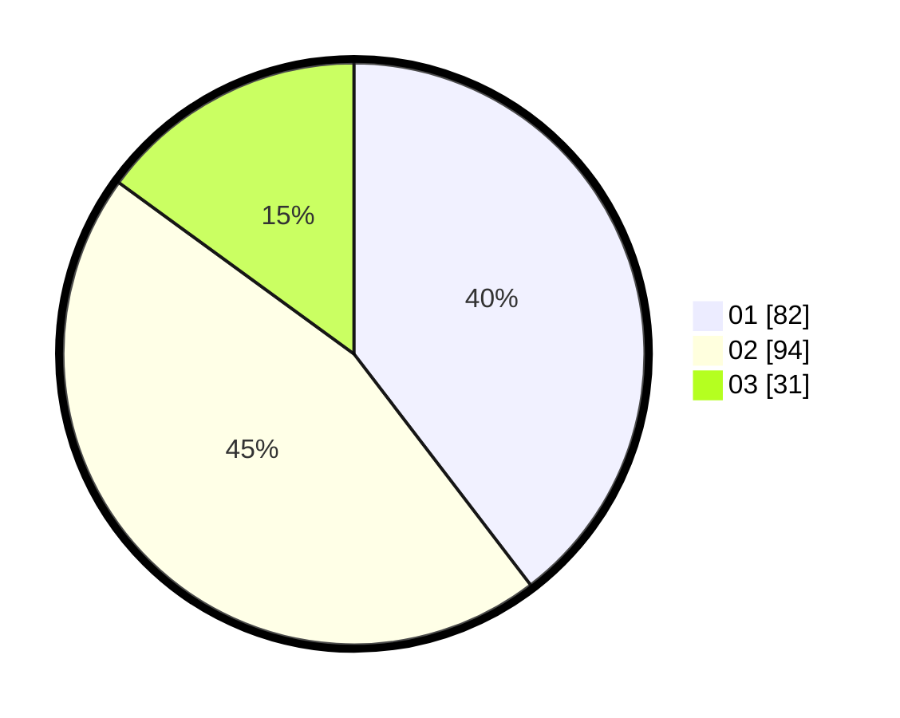

# Hasil

Hasil perolehan suara paslon dapat dilihat pada file paslon-01.txt, paslon-02.txt, dan paslon-03.txt.

Jika tidak ada, artinya data tersebut belum ada pada SIREKAP.

## Perolehan Suara

 * Paslon 01: **82**.
 * Paslon 02: **94**.
 * Paslon 03: **31**.

## Foto C Plano

https://sirekap-obj-formc.kpu.go.id/7829/pemilu/ppwp/31/72/04/10/05/3172041005065-20240214-184654--b1e9a132-cbcf-4ceb-8b18-afa614ab3ded.jpg

https://sirekap-obj-formc.kpu.go.id/7829/pemilu/ppwp/31/72/04/10/05/3172041005065-20240214-184753--894c527e-0d24-45c2-9943-a1e57b184249.jpg

https://sirekap-obj-formc.kpu.go.id/7829/pemilu/ppwp/31/72/04/10/05/3172041005065-20240214-184703--9b2072eb-c3f1-4979-a2bd-a5d81a06da0d.jpg

## DATA PEMILIH TETAP

Jumlah pemilih dalam DPT: **252**.
 * L: **119**.
 * P: **133**.

## DATA PENGGUNA HAK PILIH

Jumlah pengguna hak pilih dalam DPT: **211**.
 * L: **94**.
 * P: **117**.

Jumlah pengguna hak pilih dalam DPTb: **0**.
 * L: **0**.
 * P: **0**.

Jumlah pengguna hak pilih dalam DPK: **1**.
 * L: **0**.
 * P: **1**.

Jumlah pengguna hak pilih: **212**.
 * L: **94**.
 * P: **118**.

## JUMLAH SUARA SAH DAN TIDAK SAH

JUMLAH SELURUH SUARA SAH: **207**.

JUMLAH SUARA TIDAK SAH: **5**.

JUMLAH SELURUH SUARA SAH DAN SUARA TIDAK SAH: **212**.
