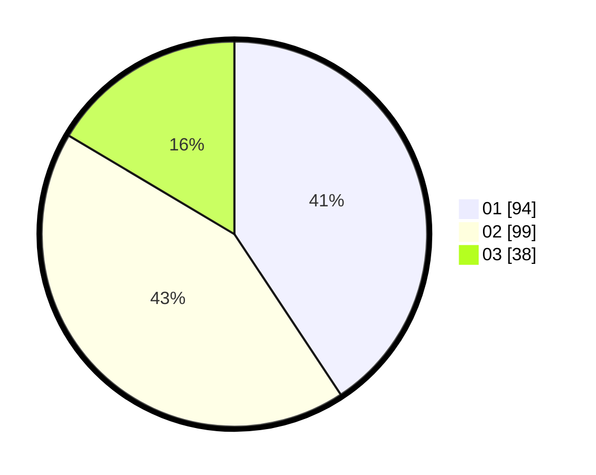

# Hasil

Hasil perolehan suara paslon dapat dilihat pada file paslon-01.txt, paslon-02.txt, dan paslon-03.txt.

Jika tidak ada, artinya data tersebut belum ada pada SIREKAP.

## Perolehan Suara

 * Paslon 01: **94**.
 * Paslon 02: **99**.
 * Paslon 03: **38**.

## Foto C Plano

https://sirekap-obj-formc.kpu.go.id/39f5/pemilu/ppwp/31/72/04/10/05/3172041005068-20240214-213223--3bbc7798-7fab-4b99-858c-4055b31e4c01.jpg

https://sirekap-obj-formc.kpu.go.id/39f5/pemilu/ppwp/31/72/04/10/05/3172041005068-20240214-231325--bdb0052b-a405-46b9-b559-51ae7a8a5f3e.jpg

https://sirekap-obj-formc.kpu.go.id/39f5/pemilu/ppwp/31/72/04/10/05/3172041005068-20240215-195648--321b7102-3c45-444e-b333-946d0d2f49fb.jpg
