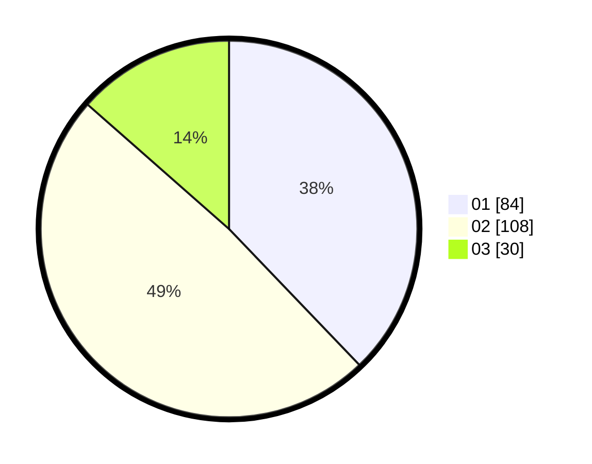

# Hasil

Hasil perolehan suara paslon dapat dilihat pada file paslon-01.txt, paslon-02.txt, dan paslon-03.txt.

Jika tidak ada, artinya data tersebut belum ada pada SIREKAP.

## Perolehan Suara

 * Paslon 01: **84**.
 * Paslon 02: **108**.
 * Paslon 03: **30**.

## Foto C Plano

https://sirekap-obj-formc.kpu.go.id/ef5c/pemilu/ppwp/31/72/04/10/05/3172041005072-20240214-155151--83a16fc3-f9d2-46a0-93c6-09733cbc4184.jpg

https://sirekap-obj-formc.kpu.go.id/ef5c/pemilu/ppwp/31/72/04/10/05/3172041005072-20240214-155145--8f007351-a864-4f54-aaad-ce2a3cc10893.jpg

https://sirekap-obj-formc.kpu.go.id/ef5c/pemilu/ppwp/31/72/04/10/05/3172041005072-20240214-194011--e037d0ca-16ce-45b7-bed6-f7733d2e14dc.jpg

## DATA PEMILIH TETAP

Jumlah pemilih dalam DPT: **279**.
 * L: **134**.
 * P: **145**.

## DATA PENGGUNA HAK PILIH

Jumlah pengguna hak pilih dalam DPT: **226**.
 * L: **101**.
 * P: **125**.

Jumlah pengguna hak pilih dalam DPTb: **0**.
 * L: **0**.
 * P: **0**.

Jumlah pengguna hak pilih dalam DPK: **2**.
 * L: **2**.
 * P: **0**.

Jumlah pengguna hak pilih: **228**.
 * L: **103**.
 * P: **125**.

## JUMLAH SUARA SAH DAN TIDAK SAH

JUMLAH SELURUH SUARA SAH: **222**.

JUMLAH SUARA TIDAK SAH: **6**.

JUMLAH SELURUH SUARA SAH DAN SUARA TIDAK SAH: **228**.
