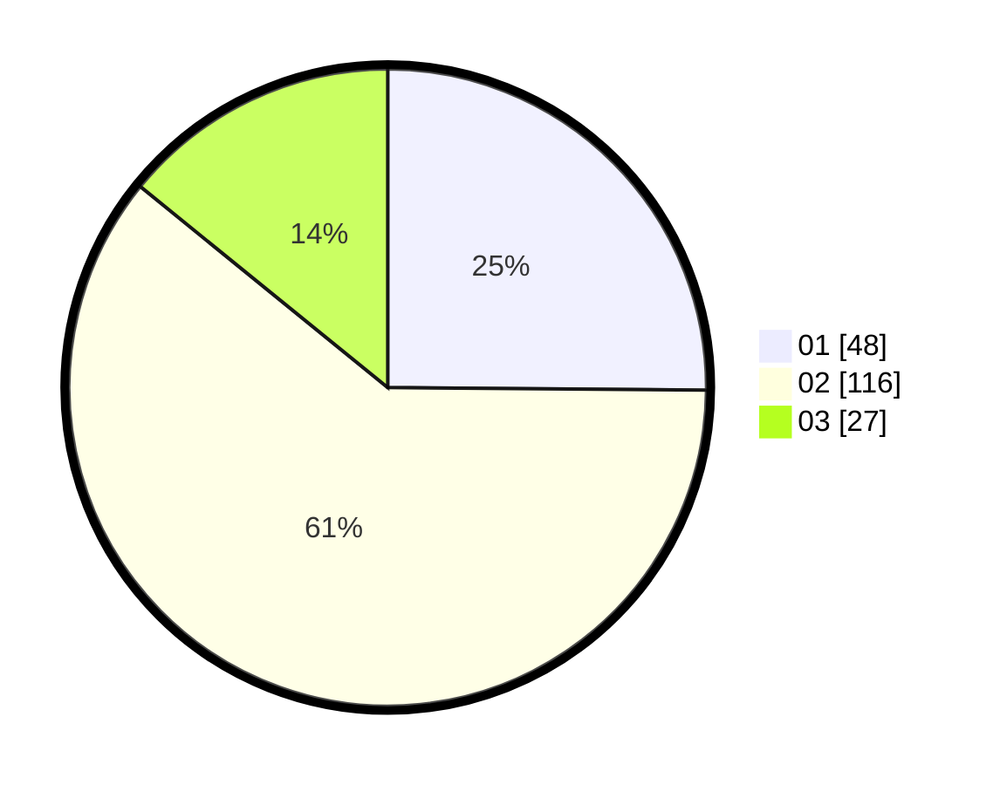

# Hasil

Hasil perolehan suara paslon dapat dilihat pada file paslon-01.txt, paslon-02.txt, dan paslon-03.txt.

Jika tidak ada, artinya data tersebut belum ada pada SIREKAP.

## Perolehan Suara

 * Paslon 01: **48**.
 * Paslon 02: **116**.
 * Paslon 03: **27**.

## Foto C Plano

https://sirekap-obj-formc.kpu.go.id/3cca/pemilu/ppwp/31/72/04/10/05/3172041005090-20240215-001031--604b29fb-75da-447d-a3dc-274e65e98cb5.jpg

https://sirekap-obj-formc.kpu.go.id/3cca/pemilu/ppwp/31/72/04/10/05/3172041005090-20240215-001208--90a112ef-0083-4793-af06-b4b2ac57bf53.jpg

https://sirekap-obj-formc.kpu.go.id/3cca/pemilu/ppwp/31/72/04/10/05/3172041005090-20240215-001333--231e6aa2-0c73-4942-a032-22200b6b2bf8.jpg

## DATA PEMILIH TETAP

Jumlah pemilih dalam DPT: **191**.
 * L: **110**.
 * P: **81**.

## DATA PENGGUNA HAK PILIH

Jumlah pengguna hak pilih dalam DPT: **268**.
 * L: **157**.
 * P: **111**.

Jumlah pengguna hak pilih dalam DPTb: **0**.
 * L: **0**.
 * P: **0**.

Jumlah pengguna hak pilih dalam DPK: **0**.
 * L: **0**.
 * P: **0**.

Jumlah pengguna hak pilih: **268**.
 * L: **157**.
 * P: **112**.

## JUMLAH SUARA SAH DAN TIDAK SAH

JUMLAH SELURUH SUARA SAH: **191**.

JUMLAH SUARA TIDAK SAH: **0**.

JUMLAH SELURUH SUARA SAH DAN SUARA TIDAK SAH: **191**.
