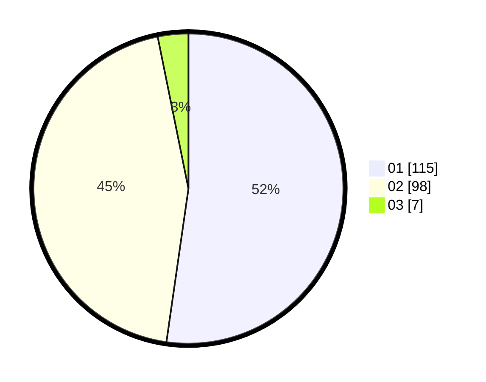

# Hasil

Hasil perolehan suara paslon dapat dilihat pada file paslon-01.txt, paslon-02.txt, dan paslon-03.txt.

Jika tidak ada, artinya data tersebut belum ada pada SIREKAP.

## Perolehan Suara

 * Paslon 01: **115**.
 * Paslon 02: **98**.
 * Paslon 03: **7**.

## Foto C Plano

https://sirekap-obj-formc.kpu.go.id/0f7f/pemilu/ppwp/31/72/04/10/05/3172041005095-20240214-160057--8c4f35fd-aaf3-43d8-9510-d25be30b6ad8.jpg

https://sirekap-obj-formc.kpu.go.id/0f7f/pemilu/ppwp/31/72/04/10/05/3172041005095-20240214-160104--28579f7b-8d9a-411d-a930-0d1e2b0e1d33.jpg

https://sirekap-obj-formc.kpu.go.id/0f7f/pemilu/ppwp/31/72/04/10/05/3172041005095-20240214-162248--efb9fb1b-4c96-4b5a-9a18-edfc45feeae5.jpg
