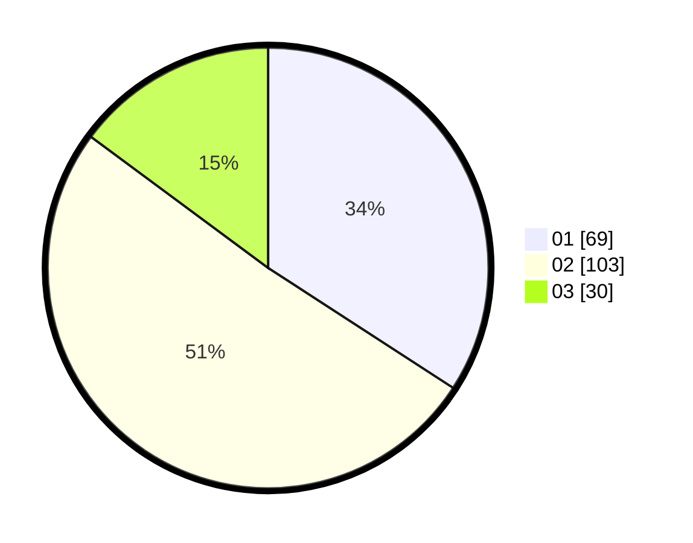

# Hasil

Hasil perolehan suara paslon dapat dilihat pada file paslon-01.txt, paslon-02.txt, dan paslon-03.txt.

Jika tidak ada, artinya data tersebut belum ada pada SIREKAP.

## Perolehan Suara

 * Paslon 01: **69**.
 * Paslon 02: **103**.
 * Paslon 03: **30**.

## Foto C Plano

https://sirekap-obj-formc.kpu.go.id/8122/pemilu/ppwp/31/72/04/10/05/3172041005102-20240214-201456--e7bb96f1-5cd5-4840-afed-cf7339ccb2f4.jpg

https://sirekap-obj-formc.kpu.go.id/8122/pemilu/ppwp/31/72/04/10/05/3172041005102-20240214-201834--5e31fc8a-4553-4dec-b0a1-500436222dfa.jpg

https://sirekap-obj-formc.kpu.go.id/8122/pemilu/ppwp/31/72/04/10/05/3172041005102-20240214-202020--2beb6f0e-d93e-4754-8499-d74a6f08f492.jpg

## DATA PEMILIH TETAP

Jumlah pemilih dalam DPT: **286**.
 * L: **148**.
 * P: **138**.

## DATA PENGGUNA HAK PILIH

Jumlah pengguna hak pilih dalam DPT: **204**.
 * L: **97**.
 * P: **107**.

Jumlah pengguna hak pilih dalam DPTb: **0**.
 * L: **0**.
 * P: **0**.

Jumlah pengguna hak pilih dalam DPK: **5**.
 * L: **1**.
 * P: **4**.

Jumlah pengguna hak pilih: **209**.
 * L: **98**.
 * P: **111**.

## JUMLAH SUARA SAH DAN TIDAK SAH

JUMLAH SELURUH SUARA SAH: **202**.

JUMLAH SUARA TIDAK SAH: **7**.

JUMLAH SELURUH SUARA SAH DAN SUARA TIDAK SAH: **209**.
