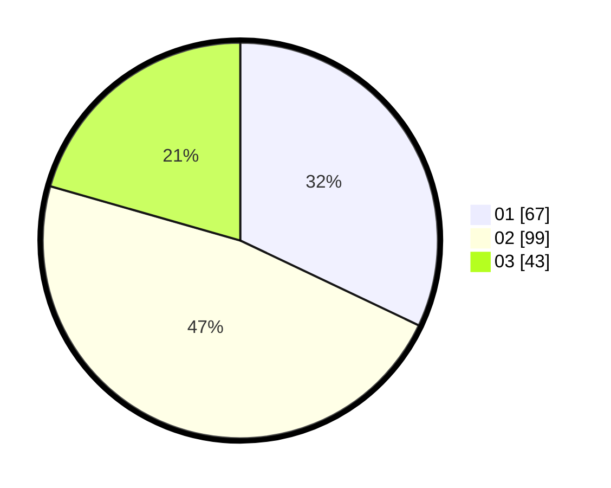

# Hasil

Hasil perolehan suara paslon dapat dilihat pada file paslon-01.txt, paslon-02.txt, dan paslon-03.txt.

Jika tidak ada, artinya data tersebut belum ada pada SIREKAP.

## Perolehan Suara

 * Paslon 01: **67**.
 * Paslon 02: **99**.
 * Paslon 03: **43**.

## Foto C Plano

https://sirekap-obj-formc.kpu.go.id/ad8f/pemilu/ppwp/31/72/04/10/05/3172041005110-20240214-200136--1bf830cd-58e0-4ba5-8383-98b0a39ddb84.jpg

https://sirekap-obj-formc.kpu.go.id/ad8f/pemilu/ppwp/31/72/04/10/05/3172041005110-20240214-201558--944bed0c-6175-4934-96a4-a3efcac8bc76.jpg

https://sirekap-obj-formc.kpu.go.id/ad8f/pemilu/ppwp/31/72/04/10/05/3172041005110-20240214-195003--6d47e20b-4c5f-45c3-89de-ebb88c7b623a.jpg

## DATA PEMILIH TETAP

Jumlah pemilih dalam DPT: **289**.
 * L: **138**.
 * P: **151**.

## DATA PENGGUNA HAK PILIH

Jumlah pengguna hak pilih dalam DPT: **208**.
 * L: **97**.
 * P: **111**.

Jumlah pengguna hak pilih dalam DPTb: **3**.
 * L: **2**.
 * P: **1**.

Jumlah pengguna hak pilih dalam DPK: **0**.
 * L: **0**.
 * P: **0**.

Jumlah pengguna hak pilih: **211**.
 * L: **99**.
 * P: **112**.

## JUMLAH SUARA SAH DAN TIDAK SAH

JUMLAH SELURUH SUARA SAH: **209**.

JUMLAH SUARA TIDAK SAH: **2**.

JUMLAH SELURUH SUARA SAH DAN SUARA TIDAK SAH: **211**.
