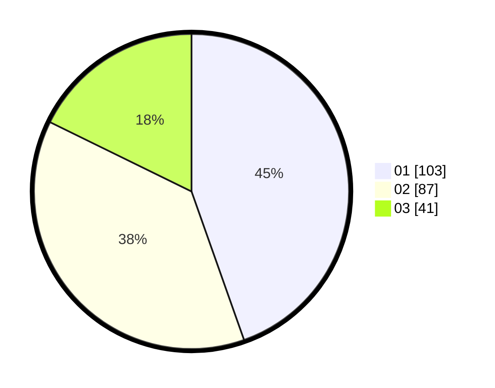

# Hasil

Hasil perolehan suara paslon dapat dilihat pada file paslon-01.txt, paslon-02.txt, dan paslon-03.txt.

Jika tidak ada, artinya data tersebut belum ada pada SIREKAP.

## Perolehan Suara

 * Paslon 01: **103**.
 * Paslon 02: **87**.
 * Paslon 03: **41**.

## Foto C Plano

https://sirekap-obj-formc.kpu.go.id/88bf/pemilu/ppwp/31/72/04/10/06/3172041006004-20240214-205930--4d7fedbc-10ec-4c01-a70d-95f2edec9537.jpg

https://sirekap-obj-formc.kpu.go.id/88bf/pemilu/ppwp/31/72/04/10/06/3172041006004-20240214-210034--75f11ef6-3392-483a-b921-912e41eb682a.jpg

https://sirekap-obj-formc.kpu.go.id/88bf/pemilu/ppwp/31/72/04/10/06/3172041006004-20240214-222343--bd10df68-cbeb-45e7-b6e4-57b9b4069cf1.jpg

## DATA PEMILIH TETAP

Jumlah pemilih dalam DPT: **289**.
 * L: **142**.
 * P: **147**.

## DATA PENGGUNA HAK PILIH

Jumlah pengguna hak pilih dalam DPT: **228**.
 * L: **105**.
 * P: **123**.

Jumlah pengguna hak pilih dalam DPTb: **1**.
 * L: **0**.
 * P: **1**.

Jumlah pengguna hak pilih dalam DPK: **6**.
 * L: **3**.
 * P: **3**.

Jumlah pengguna hak pilih: **235**.
 * L: **108**.
 * P: **127**.

## JUMLAH SUARA SAH DAN TIDAK SAH

JUMLAH SELURUH SUARA SAH: **231**.

JUMLAH SUARA TIDAK SAH: **4**.

JUMLAH SELURUH SUARA SAH DAN SUARA TIDAK SAH: **235**.
