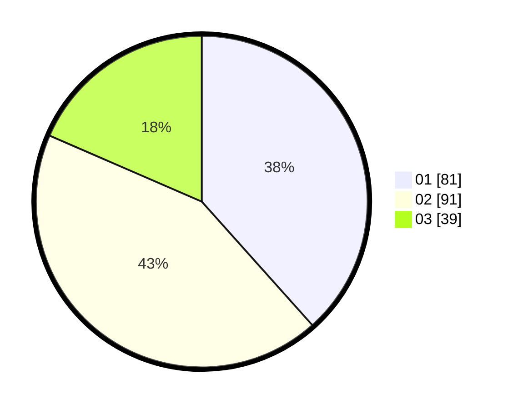

# Hasil

Hasil perolehan suara paslon dapat dilihat pada file paslon-01.txt, paslon-02.txt, dan paslon-03.txt.

Jika tidak ada, artinya data tersebut belum ada pada SIREKAP.

## Perolehan Suara

 * Paslon 01: **81**.
 * Paslon 02: **91**.
 * Paslon 03: **39**.

## Foto C Plano

https://sirekap-obj-formc.kpu.go.id/ebb1/pemilu/ppwp/31/72/04/10/06/3172041006010-20240214-195607--47556e85-c2a7-43d1-8d37-59a83e90b724.jpg

https://sirekap-obj-formc.kpu.go.id/ebb1/pemilu/ppwp/31/72/04/10/06/3172041006010-20240214-195659--bc9be849-b4f7-4f85-a18a-fe06acc80f96.jpg

https://sirekap-obj-formc.kpu.go.id/ebb1/pemilu/ppwp/31/72/04/10/06/3172041006010-20240214-195737--c567498e-596a-426d-a3f6-c16947fe6f73.jpg

## DATA PEMILIH TETAP

Jumlah pemilih dalam DPT: **207**.
 * L: **87**.
 * P: **120**.

## DATA PENGGUNA HAK PILIH

Jumlah pengguna hak pilih dalam DPT: **207**.
 * L: **87**.
 * P: **120**.

Jumlah pengguna hak pilih dalam DPTb: **4**.
 * L: **0**.
 * P: **4**.

Jumlah pengguna hak pilih dalam DPK: **2**.
 * L: **2**.
 * P: **0**.

Jumlah pengguna hak pilih: **213**.
 * L: **89**.
 * P: **124**.

## JUMLAH SUARA SAH DAN TIDAK SAH

JUMLAH SELURUH SUARA SAH: **211**.

JUMLAH SUARA TIDAK SAH: **2**.

JUMLAH SELURUH SUARA SAH DAN SUARA TIDAK SAH: **213**.
