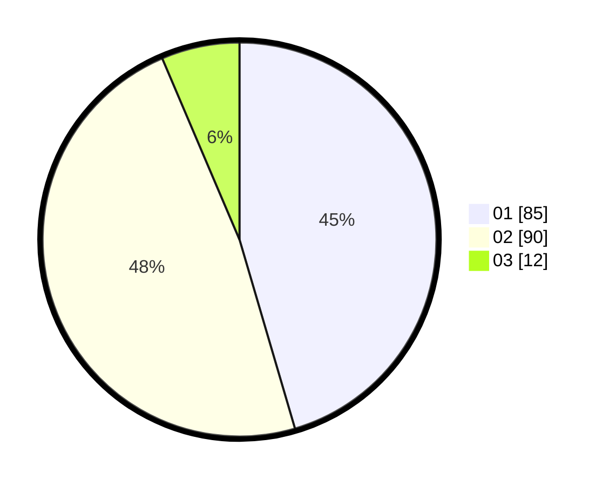

# Hasil

Hasil perolehan suara paslon dapat dilihat pada file paslon-01.txt, paslon-02.txt, dan paslon-03.txt.

Jika tidak ada, artinya data tersebut belum ada pada SIREKAP.

## Perolehan Suara

 * Paslon 01: **85**.
 * Paslon 02: **90**.
 * Paslon 03: **12**.

## Foto C Plano

https://sirekap-obj-formc.kpu.go.id/ff59/pemilu/ppwp/31/72/04/10/06/3172041006033-20240214-155350--cf577173-a154-47a0-af77-47e338084d23.jpg

https://sirekap-obj-formc.kpu.go.id/ff59/pemilu/ppwp/31/72/04/10/06/3172041006033-20240214-193843--d617aa38-e3ef-41b3-888e-0a7860ac6788.jpg

https://sirekap-obj-formc.kpu.go.id/ff59/pemilu/ppwp/31/72/04/10/06/3172041006033-20240214-193855--75caaa37-85b7-45d3-bcbf-1c81c51e32f8.jpg

## DATA PEMILIH TETAP

Jumlah pemilih dalam DPT: **259**.
 * L: **138**.
 * P: **121**.

## DATA PENGGUNA HAK PILIH

Jumlah pengguna hak pilih dalam DPT: **190**.
 * L: **98**.
 * P: **92**.

Jumlah pengguna hak pilih dalam DPTb: **1**.
 * L: **1**.
 * P: **0**.

Jumlah pengguna hak pilih dalam DPK: **0**.
 * L: **0**.
 * P: **0**.

Jumlah pengguna hak pilih: **191**.
 * L: **99**.
 * P: **92**.

## JUMLAH SUARA SAH DAN TIDAK SAH

JUMLAH SELURUH SUARA SAH: **187**.

JUMLAH SUARA TIDAK SAH: **4**.

JUMLAH SELURUH SUARA SAH DAN SUARA TIDAK SAH: **191**.
