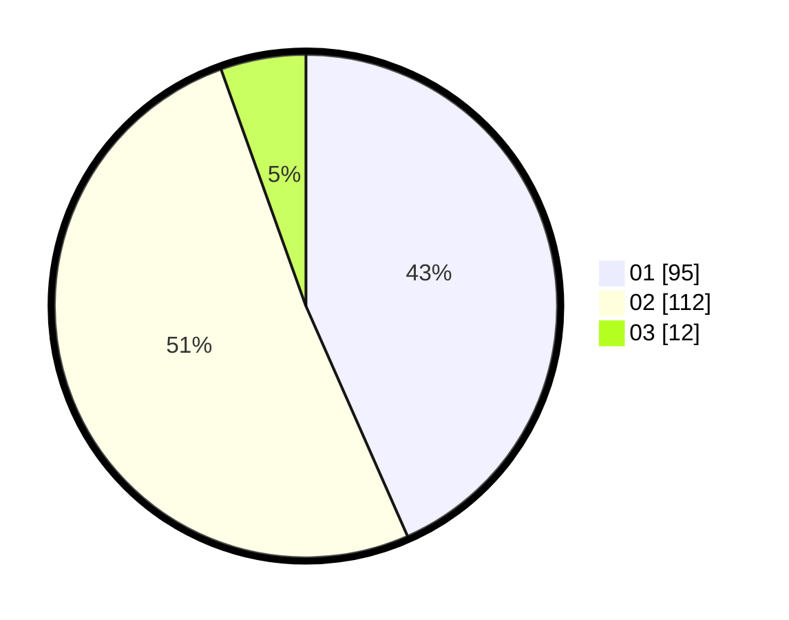

# Hasil

Hasil perolehan suara paslon dapat dilihat pada file paslon-01.txt, paslon-02.txt, dan paslon-03.txt.

Jika tidak ada, artinya data tersebut belum ada pada SIREKAP.

## Perolehan Suara

 * Paslon 01: **95**.
 * Paslon 02: **112**.
 * Paslon 03: **12**.

## Foto C Plano

https://sirekap-obj-formc.kpu.go.id/2ccb/pemilu/ppwp/31/72/04/10/06/3172041006040-20240214-212742--834bad9b-977b-4229-974b-c210c26b305a.jpg

https://sirekap-obj-formc.kpu.go.id/2ccb/pemilu/ppwp/31/72/04/10/06/3172041006040-20240214-212753--e0167fae-d8a5-47a4-bc67-f99499a1ef13.jpg

https://sirekap-obj-formc.kpu.go.id/2ccb/pemilu/ppwp/31/72/04/10/06/3172041006040-20240214-212757--63eca2ec-3bba-430f-8aa1-d7e155d80cab.jpg

## DATA PEMILIH TETAP

Jumlah pemilih dalam DPT: **284**.
 * L: **143**.
 * P: **141**.

## DATA PENGGUNA HAK PILIH

Jumlah pengguna hak pilih dalam DPT: **217**.
 * L: **103**.
 * P: **114**.

Jumlah pengguna hak pilih dalam DPTb: **2**.
 * L: **1**.
 * P: **0**.

Jumlah pengguna hak pilih dalam DPK: **3**.
 * L: **1**.
 * P: **2**.

Jumlah pengguna hak pilih: **221**.
 * L: **105**.
 * P: **116**.

## JUMLAH SUARA SAH DAN TIDAK SAH

JUMLAH SELURUH SUARA SAH: **219**.

JUMLAH SUARA TIDAK SAH: **2**.

JUMLAH SELURUH SUARA SAH DAN SUARA TIDAK SAH: **221**.
