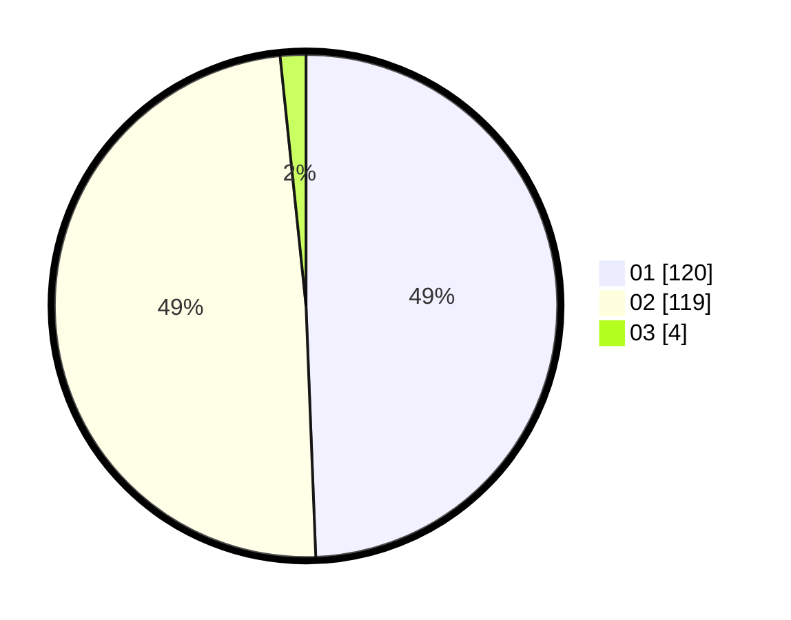

# Hasil

Hasil perolehan suara paslon dapat dilihat pada file paslon-01.txt, paslon-02.txt, dan paslon-03.txt.

Jika tidak ada, artinya data tersebut belum ada pada SIREKAP.

## Perolehan Suara

 * Paslon 01: **120**.
 * Paslon 02: **119**.
 * Paslon 03: **4**.

## Foto C Plano

https://sirekap-obj-formc.kpu.go.id/ff62/pemilu/ppwp/31/72/04/10/06/3172041006044-20240214-155253--bdc7b09f-cfd3-4100-8918-178308bc986f.jpg

https://sirekap-obj-formc.kpu.go.id/ff62/pemilu/ppwp/31/72/04/10/06/3172041006044-20240214-160057--3adfaafb-a879-4bf8-87c6-3cc1a60f6a42.jpg

https://sirekap-obj-formc.kpu.go.id/ff62/pemilu/ppwp/31/72/04/10/06/3172041006044-20240214-230941--53f214ec-77de-4b80-a75c-62366df4b26a.jpg
