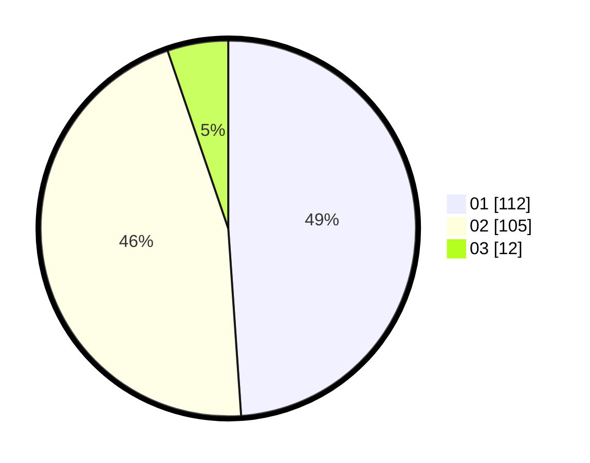

# Hasil

Hasil perolehan suara paslon dapat dilihat pada file paslon-01.txt, paslon-02.txt, dan paslon-03.txt.

Jika tidak ada, artinya data tersebut belum ada pada SIREKAP.

## Perolehan Suara

 * Paslon 01: **112**.
 * Paslon 02: **105**.
 * Paslon 03: **12**.

## Foto C Plano

https://sirekap-obj-formc.kpu.go.id/ec39/pemilu/ppwp/31/72/04/10/06/3172041006055-20240214-203013--e69481d3-cc9e-45fa-8681-69dac30bbee7.jpg

https://sirekap-obj-formc.kpu.go.id/ec39/pemilu/ppwp/31/72/04/10/06/3172041006055-20240214-203136--7805cb0e-d409-412e-98c6-5e323aaf8dcb.jpg

https://sirekap-obj-formc.kpu.go.id/ec39/pemilu/ppwp/31/72/04/10/06/3172041006055-20240214-203240--b349febc-4949-4ac4-9dbb-a7b375a92c8d.jpg

## DATA PEMILIH TETAP

Jumlah pemilih dalam DPT: **288**.
 * L: **142**.
 * P: **146**.

## DATA PENGGUNA HAK PILIH

Jumlah pengguna hak pilih dalam DPT: **235**.
 * L: **110**.
 * P: **125**.

Jumlah pengguna hak pilih dalam DPTb: **1**.
 * L: **0**.
 * P: **1**.

Jumlah pengguna hak pilih dalam DPK: **0**.
 * L: **0**.
 * P: **0**.

Jumlah pengguna hak pilih: **236**.
 * L: **110**.
 * P: **126**.

## JUMLAH SUARA SAH DAN TIDAK SAH

JUMLAH SELURUH SUARA SAH: **229**.

JUMLAH SUARA TIDAK SAH: **7**.

JUMLAH SELURUH SUARA SAH DAN SUARA TIDAK SAH: **236**.
