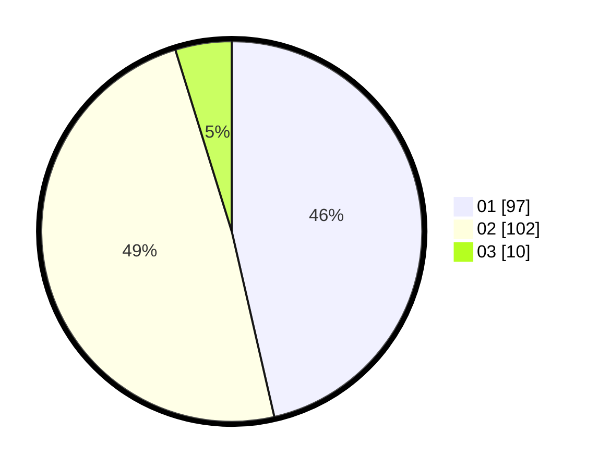

# Hasil

Hasil perolehan suara paslon dapat dilihat pada file paslon-01.txt, paslon-02.txt, dan paslon-03.txt.

Jika tidak ada, artinya data tersebut belum ada pada SIREKAP.

## Perolehan Suara

 * Paslon 01: **97**.
 * Paslon 02: **102**.
 * Paslon 03: **10**.

## Foto C Plano

https://sirekap-obj-formc.kpu.go.id/7aee/pemilu/ppwp/31/72/04/10/06/3172041006061-20240214-211612--462aa11d-c440-4551-b532-152aba2c9245.jpg

https://sirekap-obj-formc.kpu.go.id/7aee/pemilu/ppwp/31/72/04/10/06/3172041006061-20240214-211910--fef5afaa-64b5-427f-a607-50169345b7c0.jpg

https://sirekap-obj-formc.kpu.go.id/7aee/pemilu/ppwp/31/72/04/10/06/3172041006061-20240215-014739--1072e909-2e4e-40a5-8c5e-43091a210745.jpg
