# Hasil

Hasil perolehan suara paslon dapat dilihat pada file paslon-01.txt, paslon-02.txt, dan paslon-03.txt.

Jika tidak ada, artinya data tersebut belum ada pada SIREKAP.

## Perolehan Suara

 * Paslon 01: **136**.
 * Paslon 02: **94**.
 * Paslon 03: **20**.

```mermaid
%%{init: {"pie": {"textPosition": 0.5}, "themeVariables": {"pieOuterStrokeWidth": "5px"}} }%%
pie showData
    "01" : 136
    "02" : 94
    "03" : 20
```

## Foto C Plano

https://sirekap-obj-formc.kpu.go.id/21b9/pemilu/ppwp/31/72/04/10/06/3172041006062-20240216-133940--12da40b2-0173-46bc-abe2-31177611e8b1.jpg

https://sirekap-obj-formc.kpu.go.id/21b9/pemilu/ppwp/31/72/04/10/06/3172041006062-20240216-133942--f10dbef9-4e63-4a32-8362-e7af49397c3c.jpg

https://sirekap-obj-formc.kpu.go.id/21b9/pemilu/ppwp/31/72/04/10/06/3172041006062-20240216-133941--71676ec1-e284-4d0c-93d6-8c54b19d09fe.jpg

## DATA PEMILIH TETAP

Jumlah pemilih dalam DPT: **284**.
 * L: **138**.
 * P: **146**.

## DATA PENGGUNA HAK PILIH

Jumlah pengguna hak pilih dalam DPT: **250**.
 * L: **120**.
 * P: **130**.

Jumlah pengguna hak pilih dalam DPTb: **4**.
 * L: **3**.
 * P: **1**.

Jumlah pengguna hak pilih dalam DPK: **0**.
 * L: **0**.
 * P: **0**.

Jumlah pengguna hak pilih: **254**.
 * L: **123**.
 * P: **131**.

## JUMLAH SUARA SAH DAN TIDAK SAH

JUMLAH SELURUH SUARA SAH: **250**.

JUMLAH SUARA TIDAK SAH: **4**.

JUMLAH SELURUH SUARA SAH DAN SUARA TIDAK SAH: **254**.
