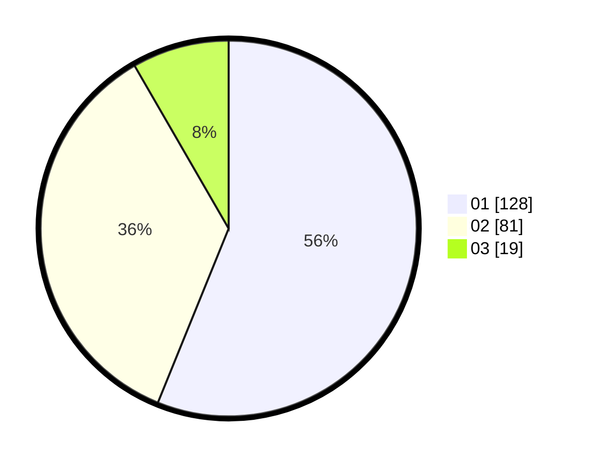

# Hasil

Hasil perolehan suara paslon dapat dilihat pada file paslon-01.txt, paslon-02.txt, dan paslon-03.txt.

Jika tidak ada, artinya data tersebut belum ada pada SIREKAP.

## Perolehan Suara

 * Paslon 01: **128**.
 * Paslon 02: **81**.
 * Paslon 03: **19**.

## Foto C Plano

https://sirekap-obj-formc.kpu.go.id/71f5/pemilu/ppwp/31/72/04/10/06/3172041006063-20240214-230058--f9f4d382-c117-4ccd-b569-ba6adabffc4e.jpg

https://sirekap-obj-formc.kpu.go.id/71f5/pemilu/ppwp/31/72/04/10/06/3172041006063-20240214-230315--c6b015d9-0517-4e47-9068-8601f18e4e8a.jpg

https://sirekap-obj-formc.kpu.go.id/71f5/pemilu/ppwp/31/72/04/10/06/3172041006063-20240214-230508--da83fe11-c513-488c-88f1-b4b33b84e6c0.jpg
