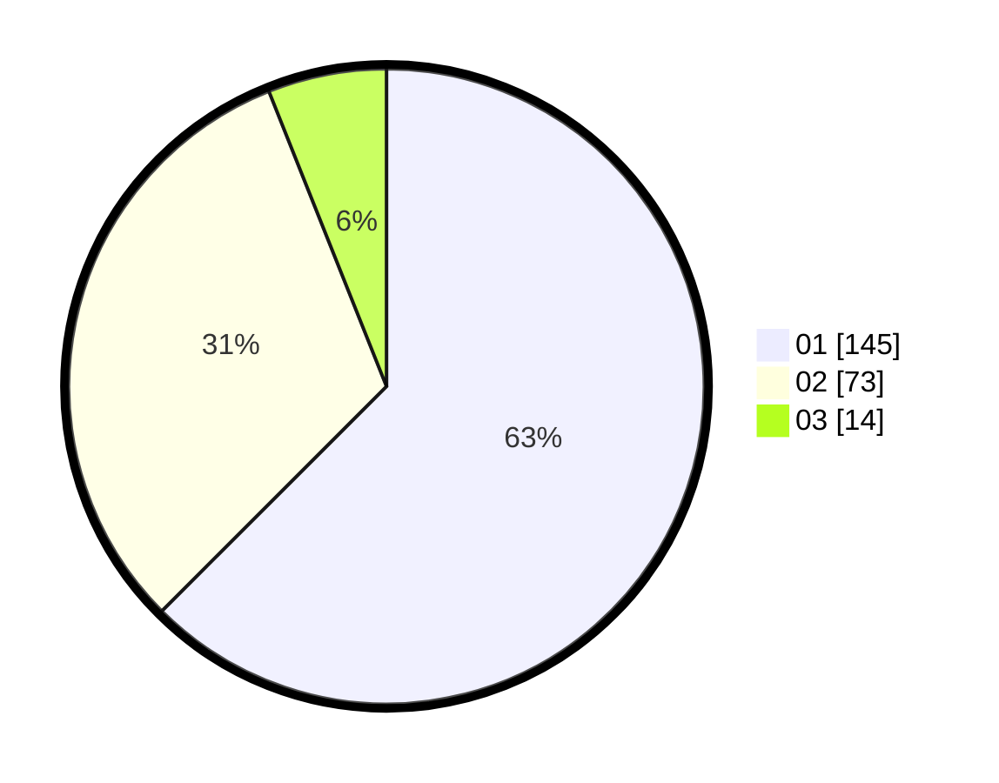

# Hasil

Hasil perolehan suara paslon dapat dilihat pada file paslon-01.txt, paslon-02.txt, dan paslon-03.txt.

Jika tidak ada, artinya data tersebut belum ada pada SIREKAP.

## Perolehan Suara

 * Paslon 01: **145**.
 * Paslon 02: **73**.
 * Paslon 03: **14**.

## Foto C Plano

https://sirekap-obj-formc.kpu.go.id/e4e7/pemilu/ppwp/31/72/04/10/06/3172041006066-20240214-202333--596d9780-09b5-4744-b318-651604d85a87.jpg

https://sirekap-obj-formc.kpu.go.id/e4e7/pemilu/ppwp/31/72/04/10/06/3172041006066-20240214-211529--60d44764-db47-4e33-be4b-d2618fb7d858.jpg

https://sirekap-obj-formc.kpu.go.id/e4e7/pemilu/ppwp/31/72/04/10/06/3172041006066-20240214-211655--8b7f360f-ca9b-40cf-9b86-17668cd7b19f.jpg

## DATA PEMILIH TETAP

Jumlah pemilih dalam DPT: **277**.
 * L: **152**.
 * P: **125**.

## DATA PENGGUNA HAK PILIH

Jumlah pengguna hak pilih dalam DPT: **223**.
 * L: **121**.
 * P: **102**.

Jumlah pengguna hak pilih dalam DPTb: **5**.
 * L: **2**.
 * P: **3**.

Jumlah pengguna hak pilih dalam DPK: **7**.
 * L: **3**.
 * P: **4**.

Jumlah pengguna hak pilih: **235**.
 * L: **126**.
 * P: **109**.

## JUMLAH SUARA SAH DAN TIDAK SAH

JUMLAH SELURUH SUARA SAH: **232**.

JUMLAH SUARA TIDAK SAH: **3**.

JUMLAH SELURUH SUARA SAH DAN SUARA TIDAK SAH: **235**.
