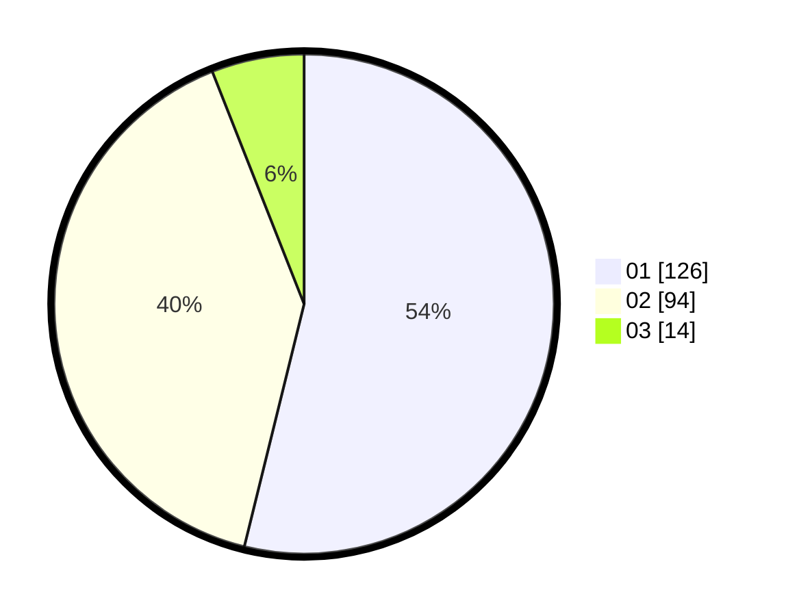

# Hasil

Hasil perolehan suara paslon dapat dilihat pada file paslon-01.txt, paslon-02.txt, dan paslon-03.txt.

Jika tidak ada, artinya data tersebut belum ada pada SIREKAP.

## Perolehan Suara

 * Paslon 01: **126**.
 * Paslon 02: **94**.
 * Paslon 03: **14**.

## Foto C Plano

https://sirekap-obj-formc.kpu.go.id/12f5/pemilu/ppwp/31/72/04/10/06/3172041006072-20240216-035936--b1c79166-c2cd-47ab-99a0-ee451a6f49eb.jpg

https://sirekap-obj-formc.kpu.go.id/12f5/pemilu/ppwp/31/72/04/10/06/3172041006072-20240216-035952--2d78e991-0aae-4f23-811b-b94a254e5939.jpg

https://sirekap-obj-formc.kpu.go.id/12f5/pemilu/ppwp/31/72/04/10/06/3172041006072-20240216-035945--e79a33b2-9268-4b21-9e41-0748373da36b.jpg

## DATA PEMILIH TETAP

Jumlah pemilih dalam DPT: **273**.
 * L: **144**.
 * P: **129**.

## DATA PENGGUNA HAK PILIH

Jumlah pengguna hak pilih dalam DPT: **236**.
 * L: **118**.
 * P: **118**.

Jumlah pengguna hak pilih dalam DPTb: **0**.
 * L: **0**.
 * P: **0**.

Jumlah pengguna hak pilih dalam DPK: **0**.
 * L: **0**.
 * P: **0**.

Jumlah pengguna hak pilih: **236**.
 * L: **118**.
 * P: **118**.

## JUMLAH SUARA SAH DAN TIDAK SAH

JUMLAH SELURUH SUARA SAH: **234**.

JUMLAH SUARA TIDAK SAH: **2**.

JUMLAH SELURUH SUARA SAH DAN SUARA TIDAK SAH: **236**.
