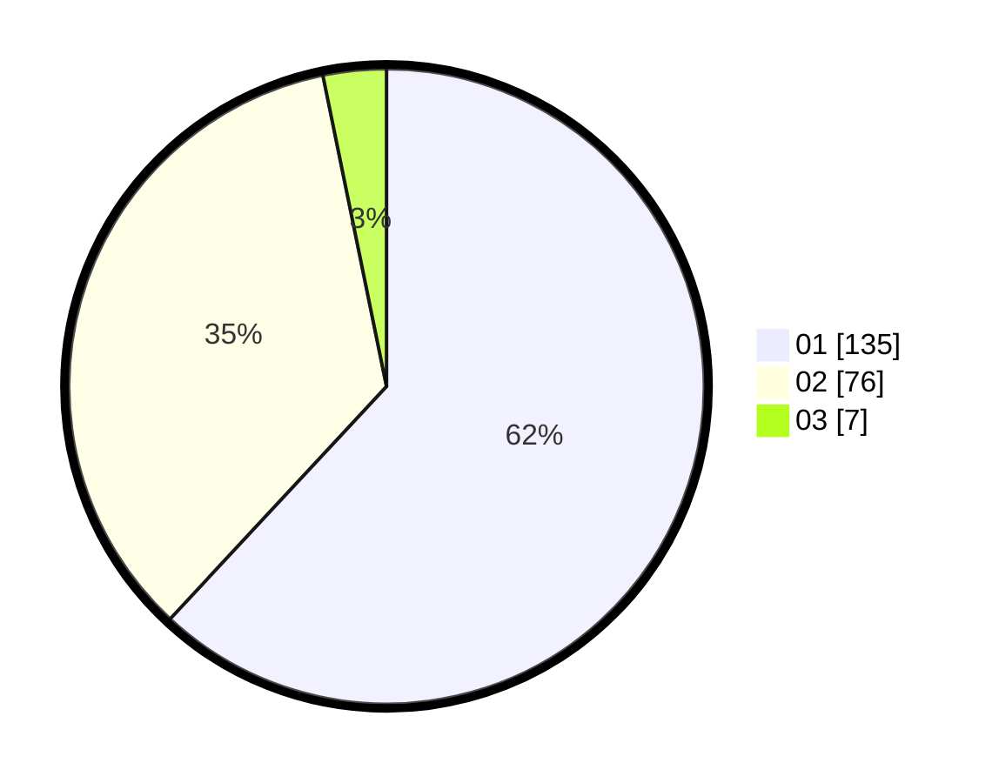

# Hasil

Hasil perolehan suara paslon dapat dilihat pada file paslon-01.txt, paslon-02.txt, dan paslon-03.txt.

Jika tidak ada, artinya data tersebut belum ada pada SIREKAP.

## Perolehan Suara

 * Paslon 01: **135**.
 * Paslon 02: **76**.
 * Paslon 03: **7**.

## Foto C Plano

https://sirekap-obj-formc.kpu.go.id/029f/pemilu/ppwp/31/72/04/10/06/3172041006083-20240214-202653--54949555-b9e5-4e8a-9636-e8c75248e4b3.jpg

https://sirekap-obj-formc.kpu.go.id/029f/pemilu/ppwp/31/72/04/10/06/3172041006083-20240214-203831--156251d9-1ade-4b0e-ad02-b70079e72f29.jpg

https://sirekap-obj-formc.kpu.go.id/029f/pemilu/ppwp/31/72/04/10/06/3172041006083-20240214-203717--09d04a5d-d9fd-4589-b13a-dc3eb7864b55.jpg

## DATA PEMILIH TETAP

Jumlah pemilih dalam DPT: **262**.
 * L: **127**.
 * P: **135**.

## DATA PENGGUNA HAK PILIH

Jumlah pengguna hak pilih dalam DPT: **221**.
 * L: **103**.
 * P: **118**.

Jumlah pengguna hak pilih dalam DPTb: **1**.
 * L: **1**.
 * P: **0**.

Jumlah pengguna hak pilih dalam DPK: **0**.
 * L: **0**.
 * P: **0**.

Jumlah pengguna hak pilih: **222**.
 * L: **104**.
 * P: **118**.

## JUMLAH SUARA SAH DAN TIDAK SAH

JUMLAH SELURUH SUARA SAH: **218**.

JUMLAH SUARA TIDAK SAH: **4**.

JUMLAH SELURUH SUARA SAH DAN SUARA TIDAK SAH: **222**.
