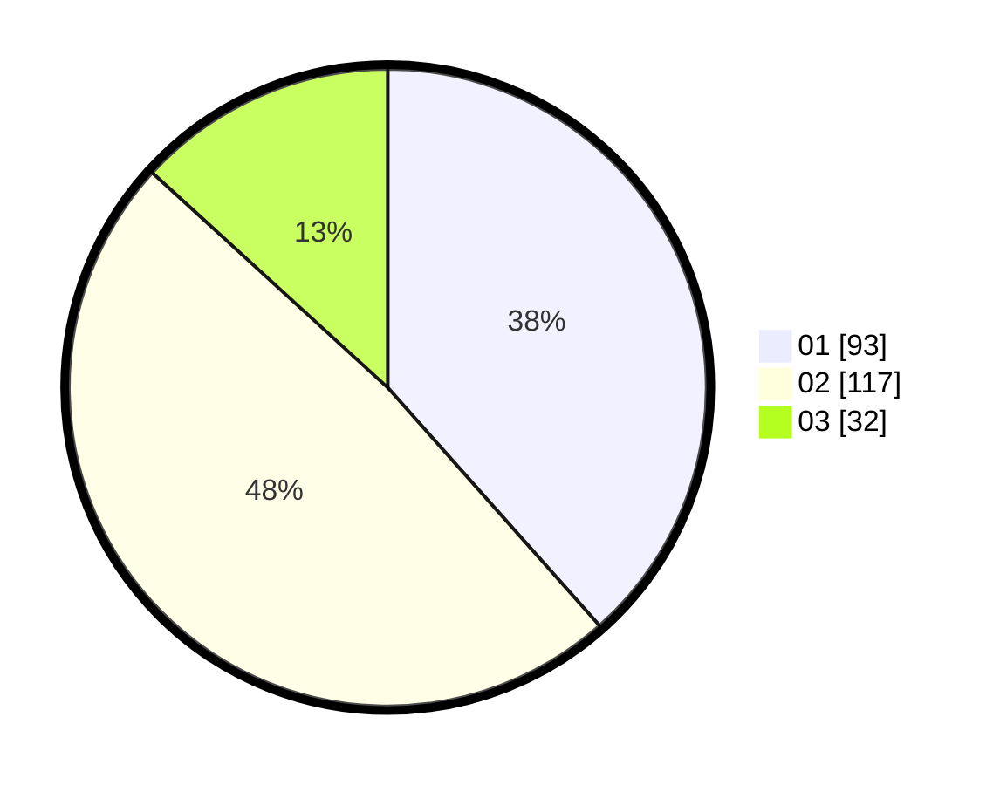

# Hasil

Hasil perolehan suara paslon dapat dilihat pada file paslon-01.txt, paslon-02.txt, dan paslon-03.txt.

Jika tidak ada, artinya data tersebut belum ada pada SIREKAP.

## Perolehan Suara

 * Paslon 01: **93**.
 * Paslon 02: **117**.
 * Paslon 03: **32**.

## Foto C Plano

https://sirekap-obj-formc.kpu.go.id/f8bf/pemilu/ppwp/31/72/04/10/06/3172041006092-20240214-211617--5b798c6f-5304-49dc-b296-730a6b5fc8d4.jpg

https://sirekap-obj-formc.kpu.go.id/f8bf/pemilu/ppwp/31/72/04/10/06/3172041006092-20240214-211722--74ab9123-931d-4b0a-a7cf-6cde5ba1dc5a.jpg

https://sirekap-obj-formc.kpu.go.id/f8bf/pemilu/ppwp/31/72/04/10/06/3172041006092-20240214-211841--9d3fc8d6-80a2-4305-add8-9136b9841fda.jpg

## DATA PEMILIH TETAP

Jumlah pemilih dalam DPT: **243**.
 * L: **114**.
 * P: **129**.

## DATA PENGGUNA HAK PILIH

Jumlah pengguna hak pilih dalam DPT: **239**.
 * L: **117**.
 * P: **126**.

Jumlah pengguna hak pilih dalam DPTb: **1**.
 * L: **0**.
 * P: **1**.

Jumlah pengguna hak pilih dalam DPK: **3**.
 * L: **1**.
 * P: **2**.

Jumlah pengguna hak pilih: **243**.
 * L: **114**.
 * P: **129**.

## JUMLAH SUARA SAH DAN TIDAK SAH

JUMLAH SELURUH SUARA SAH: **242**.

JUMLAH SUARA TIDAK SAH: **1**.

JUMLAH SELURUH SUARA SAH DAN SUARA TIDAK SAH: **243**.
