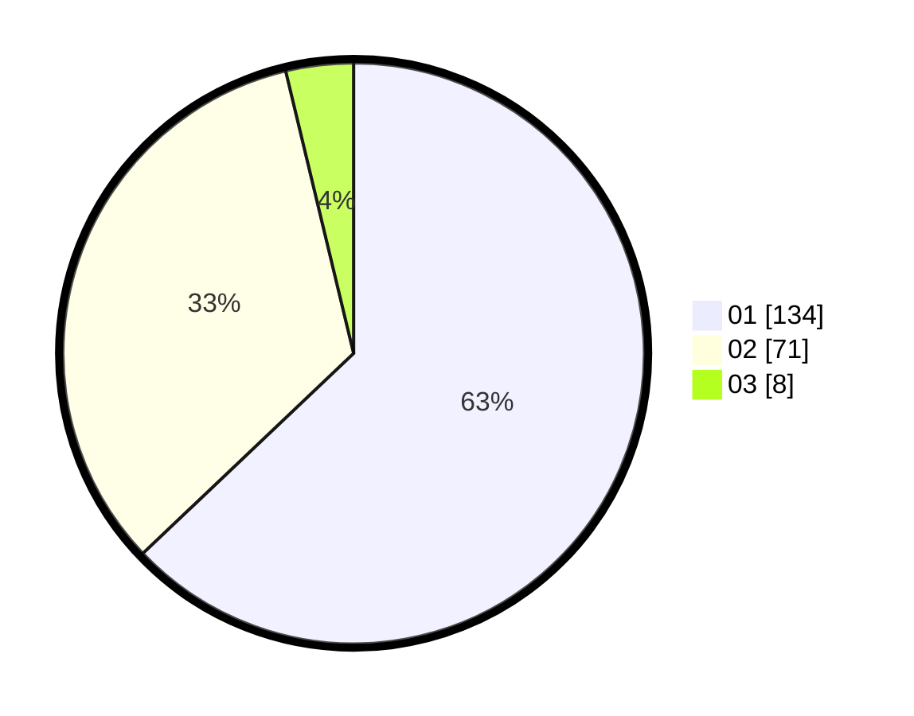

# Hasil

Hasil perolehan suara paslon dapat dilihat pada file paslon-01.txt, paslon-02.txt, dan paslon-03.txt.

Jika tidak ada, artinya data tersebut belum ada pada SIREKAP.

## Perolehan Suara

 * Paslon 01: **134**.
 * Paslon 02: **71**.
 * Paslon 03: **8**.

## Foto C Plano

https://sirekap-obj-formc.kpu.go.id/21f2/pemilu/ppwp/31/72/04/10/06/3172041006094-20240214-192127--5bd99b5a-2942-4bcc-a2e1-4981f0730ff5.jpg

https://sirekap-obj-formc.kpu.go.id/21f2/pemilu/ppwp/31/72/04/10/06/3172041006094-20240214-192142--5af7b28c-39bc-4975-a301-8aefde2e0032.jpg

https://sirekap-obj-formc.kpu.go.id/21f2/pemilu/ppwp/31/72/04/10/06/3172041006094-20240214-192111--b90de5cc-51a8-4807-bbdf-7726ffd43fd3.jpg

## DATA PEMILIH TETAP

Jumlah pemilih dalam DPT: **276**.
 * L: **142**.
 * P: **134**.

## DATA PENGGUNA HAK PILIH

Jumlah pengguna hak pilih dalam DPT: **214**.
 * L: **101**.
 * P: **113**.

Jumlah pengguna hak pilih dalam DPTb: **0**.
 * L: **0**.
 * P: **0**.

Jumlah pengguna hak pilih dalam DPK: **2**.
 * L: **1**.
 * P: **1**.

Jumlah pengguna hak pilih: **216**.
 * L: **102**.
 * P: **114**.

## JUMLAH SUARA SAH DAN TIDAK SAH

JUMLAH SELURUH SUARA SAH: **217**.

JUMLAH SUARA TIDAK SAH: **7**.

JUMLAH SELURUH SUARA SAH DAN SUARA TIDAK SAH: **215**.
