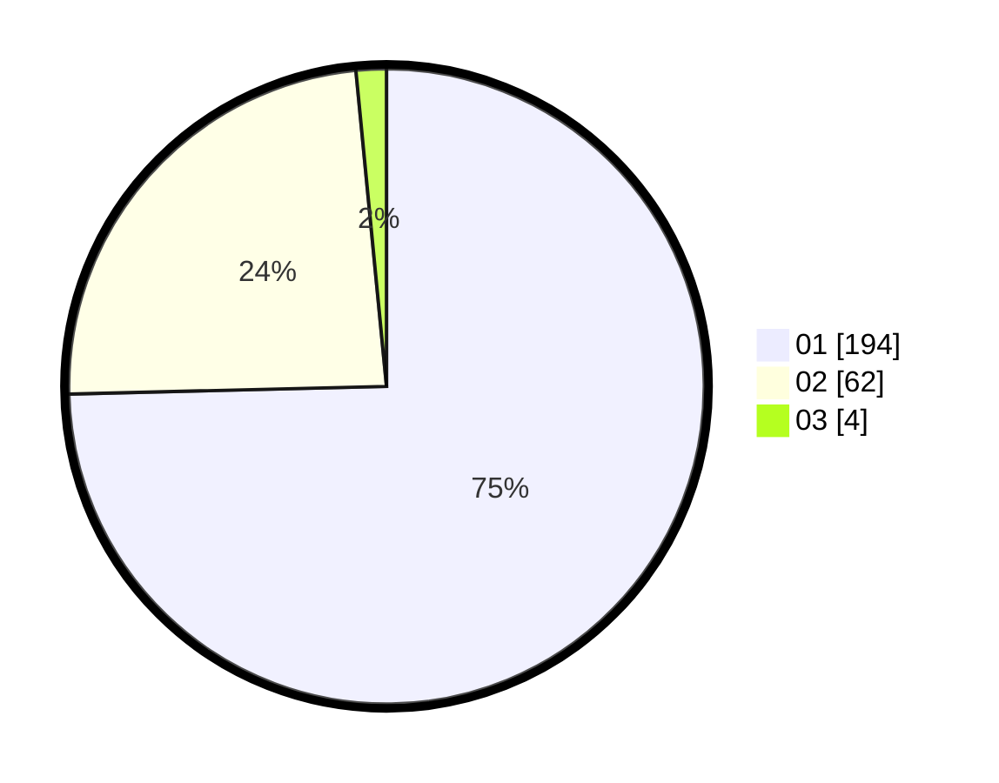

# Hasil

Hasil perolehan suara paslon dapat dilihat pada file paslon-01.txt, paslon-02.txt, dan paslon-03.txt.

Jika tidak ada, artinya data tersebut belum ada pada SIREKAP.

## Perolehan Suara

 * Paslon 01: **194**.
 * Paslon 02: **62**.
 * Paslon 03: **4**.

## Foto C Plano

https://sirekap-obj-formc.kpu.go.id/7da6/pemilu/ppwp/31/72/04/10/06/3172041006098-20240215-013225--ea1074b7-720b-44d5-ae21-5561d478b6f5.jpg

https://sirekap-obj-formc.kpu.go.id/7da6/pemilu/ppwp/31/72/04/10/06/3172041006098-20240215-012913--e70ec461-bc90-4df9-b9f2-7b26a64ca8b5.jpg

https://sirekap-obj-formc.kpu.go.id/7da6/pemilu/ppwp/31/72/04/10/06/3172041006098-20240215-013136--ec81c01c-7e50-44aa-b995-465534875b71.jpg

## DATA PEMILIH TETAP

Jumlah pemilih dalam DPT: **286**.
 * L: **135**.
 * P: **151**.

## DATA PENGGUNA HAK PILIH

Jumlah pengguna hak pilih dalam DPT: **286**.
 * L: **135**.
 * P: **151**.

Jumlah pengguna hak pilih dalam DPTb: **1**.
 * L: **0**.
 * P: **1**.

Jumlah pengguna hak pilih dalam DPK: **6**.
 * L: **4**.
 * P: **2**.

Jumlah pengguna hak pilih: **293**.
 * L: **139**.
 * P: **154**.

## JUMLAH SUARA SAH DAN TIDAK SAH

JUMLAH SELURUH SUARA SAH: **260**.

JUMLAH SUARA TIDAK SAH: **6**.

JUMLAH SELURUH SUARA SAH DAN SUARA TIDAK SAH: **266**.
