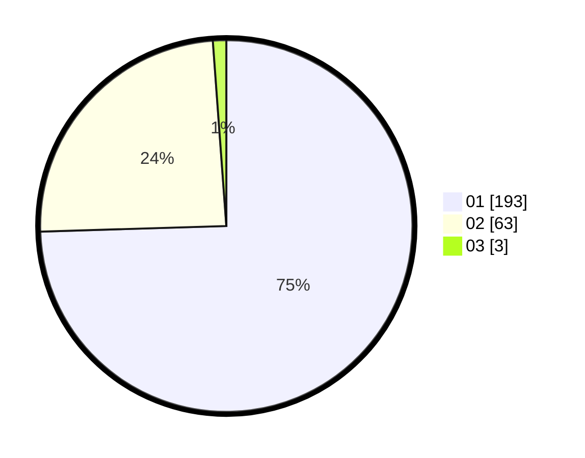

# Hasil

Hasil perolehan suara paslon dapat dilihat pada file paslon-01.txt, paslon-02.txt, dan paslon-03.txt.

Jika tidak ada, artinya data tersebut belum ada pada SIREKAP.

## Perolehan Suara

 * Paslon 01: **193**.
 * Paslon 02: **63**.
 * Paslon 03: **3**.

## Foto C Plano

https://sirekap-obj-formc.kpu.go.id/0642/pemilu/ppwp/31/72/04/10/06/3172041006100-20240214-195535--d42aad30-0d8c-4971-8a49-2f317e05919c.jpg

https://sirekap-obj-formc.kpu.go.id/0642/pemilu/ppwp/31/72/04/10/06/3172041006100-20240214-195815--a145e591-be13-432c-bf3d-f4a8c7382cd3.jpg

https://sirekap-obj-formc.kpu.go.id/0642/pemilu/ppwp/31/72/04/10/06/3172041006100-20240214-195954--0403fd3f-3bb6-493d-a283-9da4085bdc5f.jpg

## DATA PEMILIH TETAP

Jumlah pemilih dalam DPT: **290**.
 * L: **152**.
 * P: **138**.

## DATA PENGGUNA HAK PILIH

Jumlah pengguna hak pilih dalam DPT: **261**.
 * L: **140**.
 * P: **121**.

Jumlah pengguna hak pilih dalam DPTb: **3**.
 * L: **1**.
 * P: **2**.

Jumlah pengguna hak pilih dalam DPK: **0**.
 * L: **0**.
 * P: **0**.

Jumlah pengguna hak pilih: **264**.
 * L: **141**.
 * P: **123**.

## JUMLAH SUARA SAH DAN TIDAK SAH

JUMLAH SELURUH SUARA SAH: **259**.

JUMLAH SUARA TIDAK SAH: **5**.

JUMLAH SELURUH SUARA SAH DAN SUARA TIDAK SAH: **264**.
