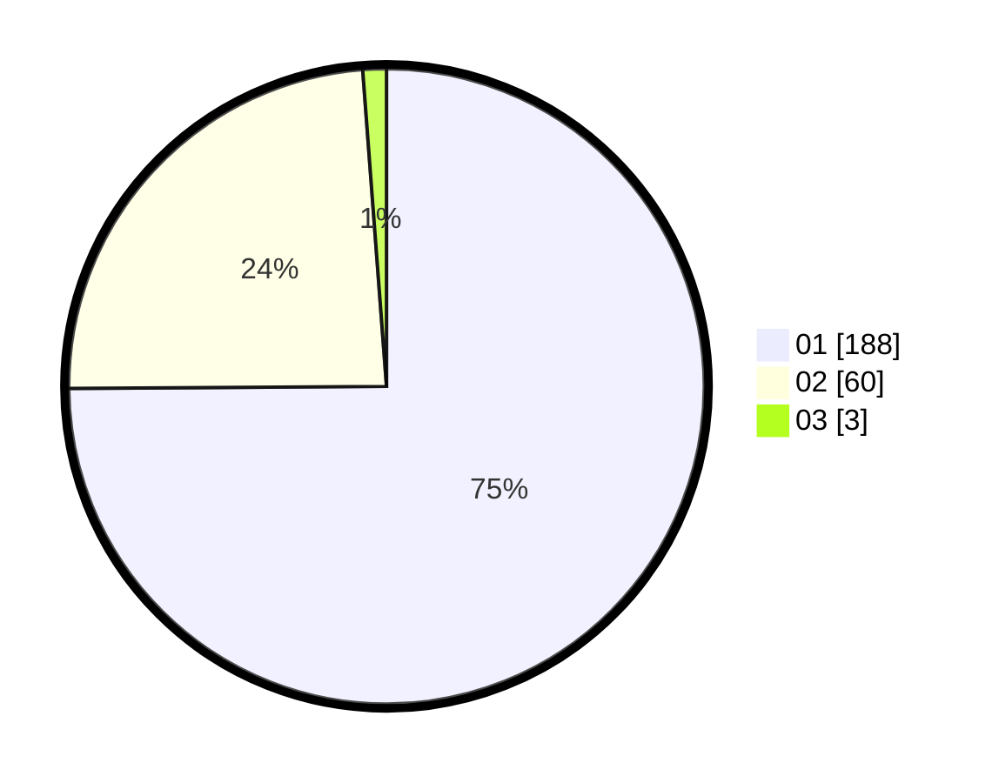

# Hasil

Hasil perolehan suara paslon dapat dilihat pada file paslon-01.txt, paslon-02.txt, dan paslon-03.txt.

Jika tidak ada, artinya data tersebut belum ada pada SIREKAP.

## Perolehan Suara

 * Paslon 01: **188**.
 * Paslon 02: **60**.
 * Paslon 03: **3**.

## Foto C Plano

https://sirekap-obj-formc.kpu.go.id/abd3/pemilu/ppwp/31/72/04/10/06/3172041006102-20240216-062124--eaffda7d-9506-4223-a9d3-1be0e2a2efb4.jpg

https://sirekap-obj-formc.kpu.go.id/abd3/pemilu/ppwp/31/72/04/10/06/3172041006102-20240216-041603--349facd2-1e3c-472a-b3ac-dd50a479ccfd.jpg

https://sirekap-obj-formc.kpu.go.id/abd3/pemilu/ppwp/31/72/04/10/06/3172041006102-20240216-062125--6aa4ed1c-ab1d-47a6-be01-c3827ec78017.jpg

## DATA PEMILIH TETAP

Jumlah pemilih dalam DPT: **255**.
 * L: **151**.
 * P: **143**.

## DATA PENGGUNA HAK PILIH

Jumlah pengguna hak pilih dalam DPT: **255**.
 * L: **132**.
 * P: **123**.

Jumlah pengguna hak pilih dalam DPTb: **0**.
 * L: **0**.
 * P: **0**.

Jumlah pengguna hak pilih dalam DPK: **0**.
 * L: **0**.
 * P: **0**.

Jumlah pengguna hak pilih: **255**.
 * L: **132**.
 * P: **123**.

## JUMLAH SUARA SAH DAN TIDAK SAH

JUMLAH SELURUH SUARA SAH: **251**.

JUMLAH SUARA TIDAK SAH: **4**.

JUMLAH SELURUH SUARA SAH DAN SUARA TIDAK SAH: **255**.
