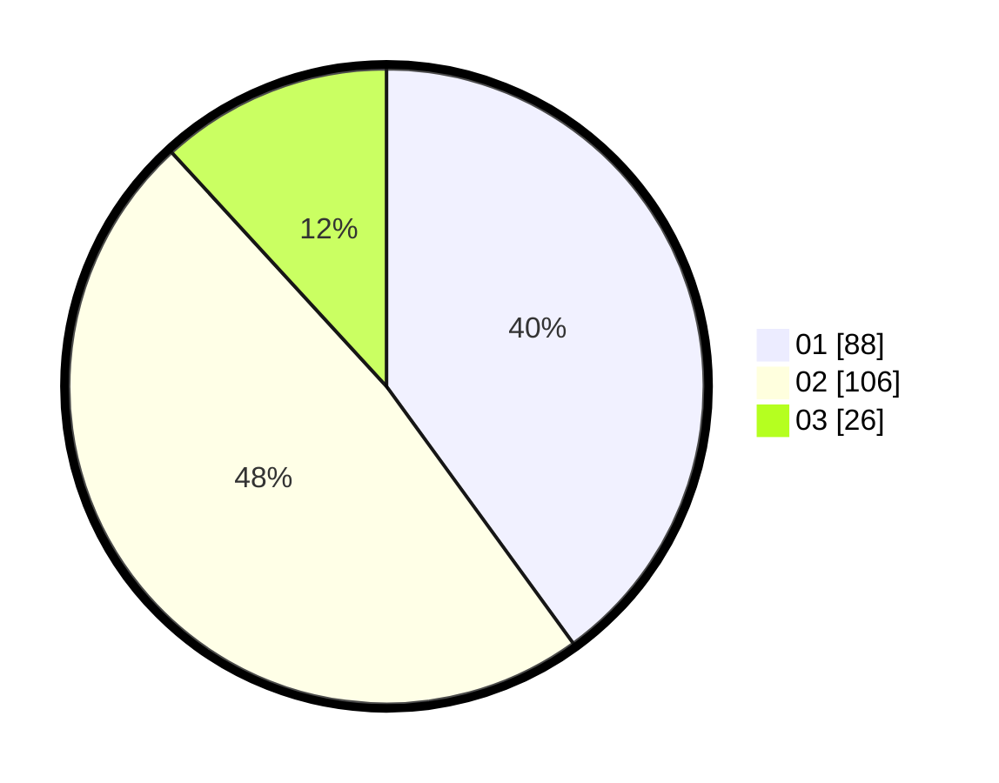

# Hasil

Hasil perolehan suara paslon dapat dilihat pada file paslon-01.txt, paslon-02.txt, dan paslon-03.txt.

Jika tidak ada, artinya data tersebut belum ada pada SIREKAP.

## Perolehan Suara

 * Paslon 01: **88**.
 * Paslon 02: **106**.
 * Paslon 03: **26**.

## Foto C Plano

https://sirekap-obj-formc.kpu.go.id/df26/pemilu/ppwp/31/72/04/10/06/3172041006112-20240214-210432--b628489f-74f3-414f-8ec6-b14b5c95e3cd.jpg

https://sirekap-obj-formc.kpu.go.id/df26/pemilu/ppwp/31/72/04/10/06/3172041006112-20240214-224924--7fb076d0-8703-4797-a739-aacff1ceddb2.jpg

https://sirekap-obj-formc.kpu.go.id/df26/pemilu/ppwp/31/72/04/10/06/3172041006112-20240214-224500--6245170f-4577-405f-8f8e-cefa30ff246a.jpg
