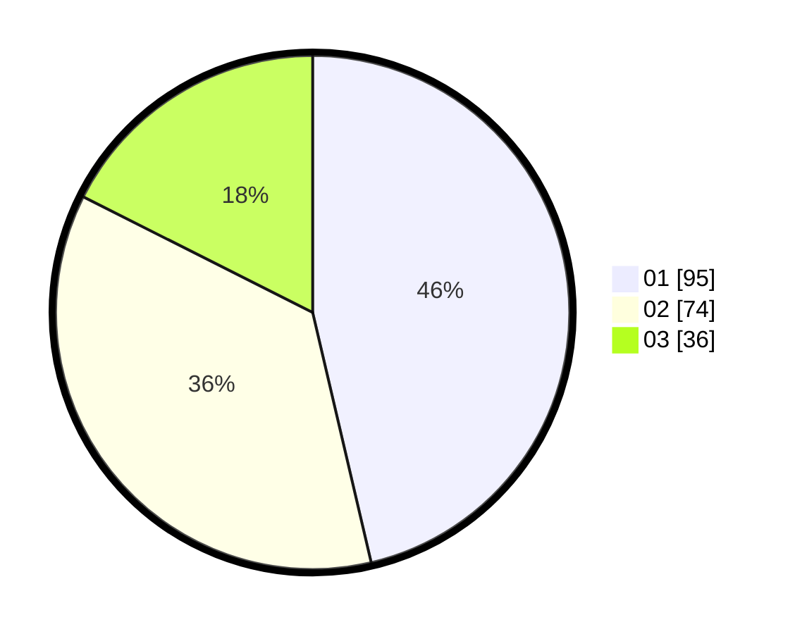

# Hasil

Hasil perolehan suara paslon dapat dilihat pada file paslon-01.txt, paslon-02.txt, dan paslon-03.txt.

Jika tidak ada, artinya data tersebut belum ada pada SIREKAP.

## Perolehan Suara

 * Paslon 01: **95**.
 * Paslon 02: **74**.
 * Paslon 03: **36**.

## Foto C Plano

https://sirekap-obj-formc.kpu.go.id/a014/pemilu/ppwp/31/72/04/10/06/3172041006117-20240214-201353--40f48847-5098-437c-b3a8-dbf09e87c632.jpg

https://sirekap-obj-formc.kpu.go.id/a014/pemilu/ppwp/31/72/04/10/06/3172041006117-20240216-174447--c69cd95b-eac3-4229-922f-a7104f338722.jpg

https://sirekap-obj-formc.kpu.go.id/a014/pemilu/ppwp/31/72/04/10/06/3172041006117-20240214-201525--219ee2be-a4fb-4161-81e3-b4d63b0ab14b.jpg

## DATA PEMILIH TETAP

Jumlah pemilih dalam DPT: **276**.
 * L: **138**.
 * P: **138**.

## DATA PENGGUNA HAK PILIH

Jumlah pengguna hak pilih dalam DPT: **203**.
 * L: **97**.
 * P: **106**.

Jumlah pengguna hak pilih dalam DPTb: **1**.
 * L: **0**.
 * P: **1**.

Jumlah pengguna hak pilih dalam DPK: **6**.
 * L: **2**.
 * P: **4**.

Jumlah pengguna hak pilih: **210**.
 * L: **99**.
 * P: **111**.

## JUMLAH SUARA SAH DAN TIDAK SAH

JUMLAH SELURUH SUARA SAH: **205**.

JUMLAH SUARA TIDAK SAH: **5**.

JUMLAH SELURUH SUARA SAH DAN SUARA TIDAK SAH: **210**.
