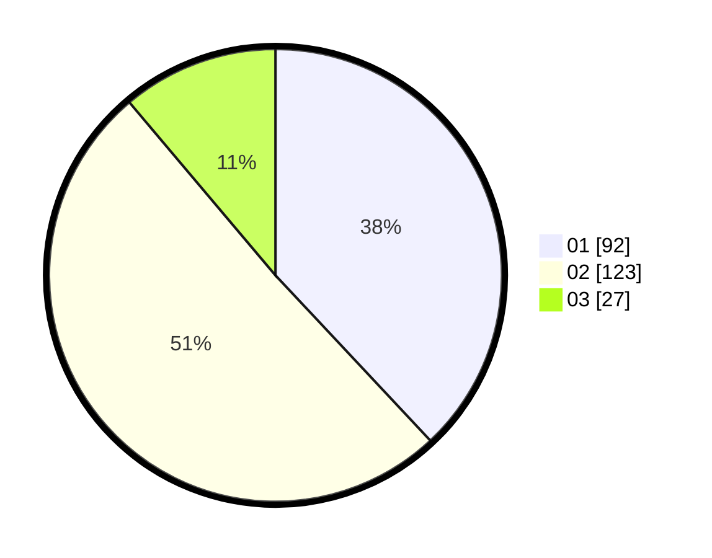

# Hasil

Hasil perolehan suara paslon dapat dilihat pada file paslon-01.txt, paslon-02.txt, dan paslon-03.txt.

Jika tidak ada, artinya data tersebut belum ada pada SIREKAP.

## Perolehan Suara

 * Paslon 01: **92**.
 * Paslon 02: **123**.
 * Paslon 03: **27**.

## Foto C Plano

https://sirekap-obj-formc.kpu.go.id/eb3c/pemilu/ppwp/31/72/04/10/06/3172041006119-20240216-055416--3b62d10d-b0c3-4921-b16d-01e735964bc1.jpg

https://sirekap-obj-formc.kpu.go.id/eb3c/pemilu/ppwp/31/72/04/10/06/3172041006119-20240216-055418--4522a248-7ad4-4eb6-9f95-ca139059c0f3.jpg

https://sirekap-obj-formc.kpu.go.id/eb3c/pemilu/ppwp/31/72/04/10/06/3172041006119-20240216-055417--ddadf3d4-3f62-4c42-b31a-dfdb0d6e473f.jpg

## DATA PEMILIH TETAP

Jumlah pemilih dalam DPT: **282**.
 * L: **139**.
 * P: **143**.

## DATA PENGGUNA HAK PILIH

Jumlah pengguna hak pilih dalam DPT: **241**.
 * L: **116**.
 * P: **125**.

Jumlah pengguna hak pilih dalam DPTb: **1**.
 * L: **1**.
 * P: **0**.

Jumlah pengguna hak pilih dalam DPK: **5**.
 * L: **3**.
 * P: **2**.

Jumlah pengguna hak pilih: **247**.
 * L: **120**.
 * P: **127**.

## JUMLAH SUARA SAH DAN TIDAK SAH

JUMLAH SELURUH SUARA SAH: **242**.

JUMLAH SUARA TIDAK SAH: **5**.

JUMLAH SELURUH SUARA SAH DAN SUARA TIDAK SAH: **247**.
