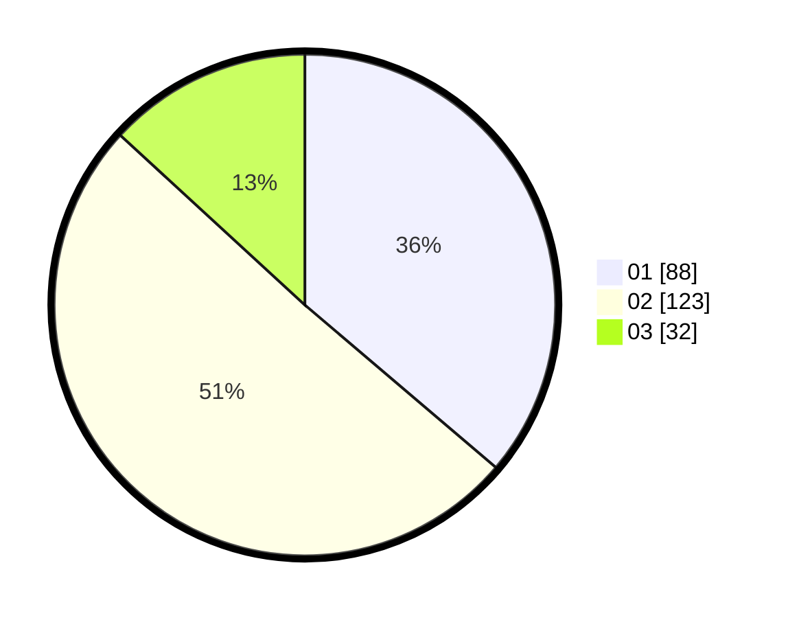

# Hasil

Hasil perolehan suara paslon dapat dilihat pada file paslon-01.txt, paslon-02.txt, dan paslon-03.txt.

Jika tidak ada, artinya data tersebut belum ada pada SIREKAP.

## Perolehan Suara

 * Paslon 01: **88**.
 * Paslon 02: **123**.
 * Paslon 03: **32**.

## Foto C Plano

https://sirekap-obj-formc.kpu.go.id/85cd/pemilu/ppwp/31/72/04/10/06/3172041006122-20240214-222808--c0e395da-943a-4d18-8262-d016aa476564.jpg

https://sirekap-obj-formc.kpu.go.id/85cd/pemilu/ppwp/31/72/04/10/06/3172041006122-20240214-222910--b40f77ca-368a-4df7-939b-029d74b3f349.jpg

https://sirekap-obj-formc.kpu.go.id/85cd/pemilu/ppwp/31/72/04/10/06/3172041006122-20240214-222951--52010295-0377-4ed4-bf33-1bf36cd53abd.jpg

## DATA PEMILIH TETAP

Jumlah pemilih dalam DPT: **295**.
 * L: **143**.
 * P: **152**.

## DATA PENGGUNA HAK PILIH

Jumlah pengguna hak pilih dalam DPT: **238**.
 * L: **106**.
 * P: **132**.

Jumlah pengguna hak pilih dalam DPTb: **1**.
 * L: **0**.
 * P: **1**.

Jumlah pengguna hak pilih dalam DPK: **6**.
 * L: **1**.
 * P: **5**.

Jumlah pengguna hak pilih: **245**.
 * L: **107**.
 * P: **138**.

## JUMLAH SUARA SAH DAN TIDAK SAH

JUMLAH SELURUH SUARA SAH: **243**.

JUMLAH SUARA TIDAK SAH: **2**.

JUMLAH SELURUH SUARA SAH DAN SUARA TIDAK SAH: **245**.
