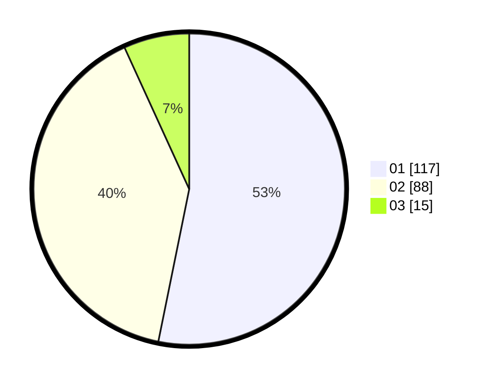

# Hasil

Hasil perolehan suara paslon dapat dilihat pada file paslon-01.txt, paslon-02.txt, dan paslon-03.txt.

Jika tidak ada, artinya data tersebut belum ada pada SIREKAP.

## Perolehan Suara

 * Paslon 01: **117**.
 * Paslon 02: **88**.
 * Paslon 03: **15**.

## Foto C Plano

https://sirekap-obj-formc.kpu.go.id/7d50/pemilu/ppwp/31/72/04/10/06/3172041006127-20240214-195234--a5568315-6603-4d69-ba20-8472a6c066a2.jpg

https://sirekap-obj-formc.kpu.go.id/7d50/pemilu/ppwp/31/72/04/10/06/3172041006127-20240214-195249--aec8c641-3d68-4658-8d58-44e65775ad10.jpg

https://sirekap-obj-formc.kpu.go.id/7d50/pemilu/ppwp/31/72/04/10/06/3172041006127-20240214-195253--3cafec31-31c4-4619-9b92-efd59f5df60f.jpg

## DATA PEMILIH TETAP

Jumlah pemilih dalam DPT: **283**.
 * L: **151**.
 * P: **132**.

## DATA PENGGUNA HAK PILIH

Jumlah pengguna hak pilih dalam DPT: **218**.
 * L: **109**.
 * P: **109**.

Jumlah pengguna hak pilih dalam DPTb: **1**.
 * L: **0**.
 * P: **1**.

Jumlah pengguna hak pilih dalam DPK: **3**.
 * L: **1**.
 * P: **2**.

Jumlah pengguna hak pilih: **222**.
 * L: **110**.
 * P: **112**.

## JUMLAH SUARA SAH DAN TIDAK SAH

JUMLAH SELURUH SUARA SAH: **220**.

JUMLAH SUARA TIDAK SAH: **2**.

JUMLAH SELURUH SUARA SAH DAN SUARA TIDAK SAH: **222**.
