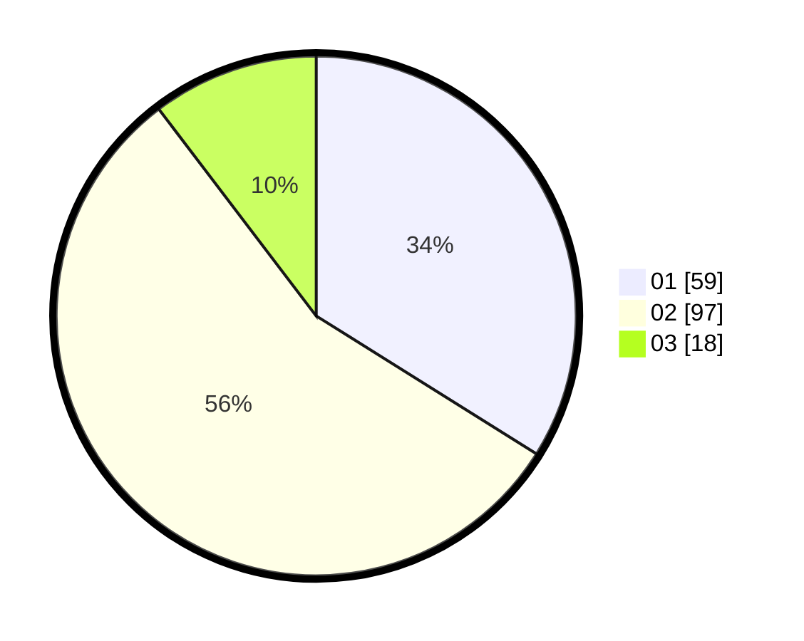

# Hasil

Hasil perolehan suara paslon dapat dilihat pada file paslon-01.txt, paslon-02.txt, dan paslon-03.txt.

Jika tidak ada, artinya data tersebut belum ada pada SIREKAP.

## Perolehan Suara

 * Paslon 01: **59**.
 * Paslon 02: **97**.
 * Paslon 03: **18**.

## Foto C Plano

https://sirekap-obj-formc.kpu.go.id/c485/pemilu/ppwp/31/72/04/10/06/3172041006135-20240214-230635--5bf8c014-8054-489f-9e44-bbf70cfad2b1.jpg

https://sirekap-obj-formc.kpu.go.id/c485/pemilu/ppwp/31/72/04/10/06/3172041006135-20240214-230734--17522318-a30f-431e-8230-e88412165aba.jpg

https://sirekap-obj-formc.kpu.go.id/c485/pemilu/ppwp/31/72/04/10/06/3172041006135-20240214-230827--616cb290-f3f8-4964-b36c-a72898c7349c.jpg

## DATA PEMILIH TETAP

Jumlah pemilih dalam DPT: **255**.
 * L: **128**.
 * P: **127**.

## DATA PENGGUNA HAK PILIH

Jumlah pengguna hak pilih dalam DPT: **167**.
 * L: **80**.
 * P: **87**.

Jumlah pengguna hak pilih dalam DPTb: **9**.
 * L: **3**.
 * P: **6**.

Jumlah pengguna hak pilih dalam DPK: **0**.
 * L: **0**.
 * P: **0**.

Jumlah pengguna hak pilih: **176**.
 * L: **83**.
 * P: **93**.

## JUMLAH SUARA SAH DAN TIDAK SAH

JUMLAH SELURUH SUARA SAH: **174**.

JUMLAH SUARA TIDAK SAH: **2**.

JUMLAH SELURUH SUARA SAH DAN SUARA TIDAK SAH: **176**.
