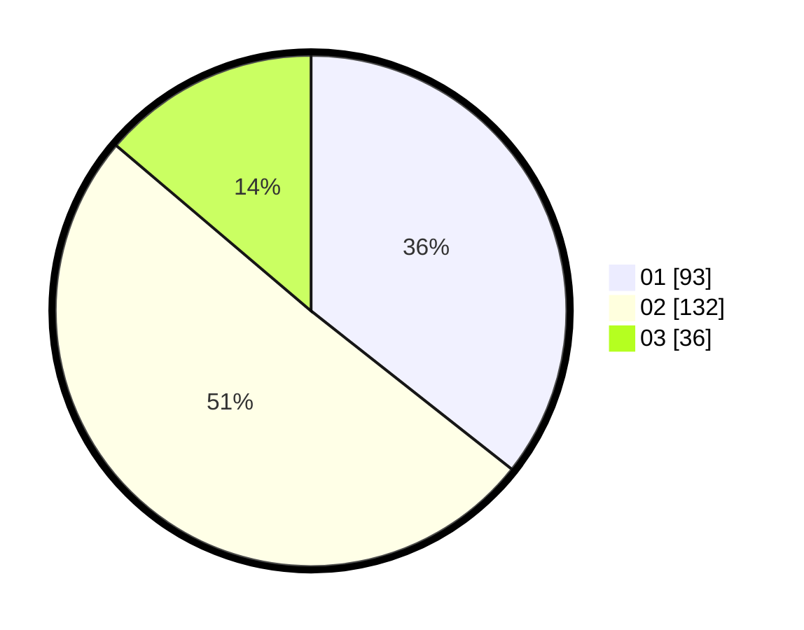

# Hasil

Hasil perolehan suara paslon dapat dilihat pada file paslon-01.txt, paslon-02.txt, dan paslon-03.txt.

Jika tidak ada, artinya data tersebut belum ada pada SIREKAP.

## Perolehan Suara

 * Paslon 01: **93**.
 * Paslon 02: **132**.
 * Paslon 03: **36**.

## Foto C Plano

https://sirekap-obj-formc.kpu.go.id/d3ef/pemilu/ppwp/31/72/04/10/06/3172041006140-20240214-155417--49b1455c-4639-4f0d-8fdd-fb32e18aa177.jpg

https://sirekap-obj-formc.kpu.go.id/d3ef/pemilu/ppwp/31/72/04/10/06/3172041006140-20240214-155447--114813f4-8769-4986-a7bf-18ca91bbcf4f.jpg

https://sirekap-obj-formc.kpu.go.id/d3ef/pemilu/ppwp/31/72/04/10/06/3172041006140-20240214-155505--6d2f46ed-7ff7-4ae3-91a3-2f911f0810aa.jpg

## DATA PEMILIH TETAP

Jumlah pemilih dalam DPT: **290**.
 * L: **141**.
 * P: **149**.

## DATA PENGGUNA HAK PILIH

Jumlah pengguna hak pilih dalam DPT: **260**.
 * L: **123**.
 * P: **137**.

Jumlah pengguna hak pilih dalam DPTb: **1**.
 * L: **0**.
 * P: **1**.

Jumlah pengguna hak pilih dalam DPK: **3**.
 * L: **2**.
 * P: **1**.

Jumlah pengguna hak pilih: **264**.
 * L: **125**.
 * P: **139**.

## JUMLAH SUARA SAH DAN TIDAK SAH

JUMLAH SELURUH SUARA SAH: **261**.

JUMLAH SUARA TIDAK SAH: **3**.

JUMLAH SELURUH SUARA SAH DAN SUARA TIDAK SAH: **264**.
