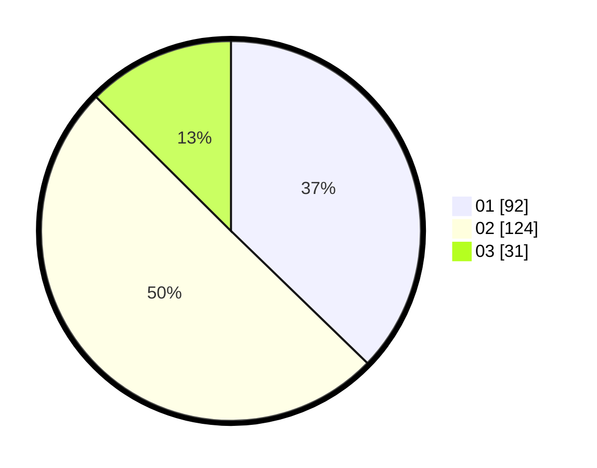

# Hasil

Hasil perolehan suara paslon dapat dilihat pada file paslon-01.txt, paslon-02.txt, dan paslon-03.txt.

Jika tidak ada, artinya data tersebut belum ada pada SIREKAP.

## Perolehan Suara

 * Paslon 01: **92**.
 * Paslon 02: **124**.
 * Paslon 03: **31**.

## Foto C Plano

https://sirekap-obj-formc.kpu.go.id/5831/pemilu/ppwp/31/72/04/10/06/3172041006141-20240214-205841--525830c4-4de7-40c8-a168-05f4af4e70bc.jpg

https://sirekap-obj-formc.kpu.go.id/5831/pemilu/ppwp/31/72/04/10/06/3172041006141-20240214-210542--7f6a81f9-56b7-43f4-87fd-5173fc3eeafa.jpg

https://sirekap-obj-formc.kpu.go.id/5831/pemilu/ppwp/31/72/04/10/06/3172041006141-20240214-210650--e48dc269-3431-456f-85f3-8d0cca9be863.jpg
