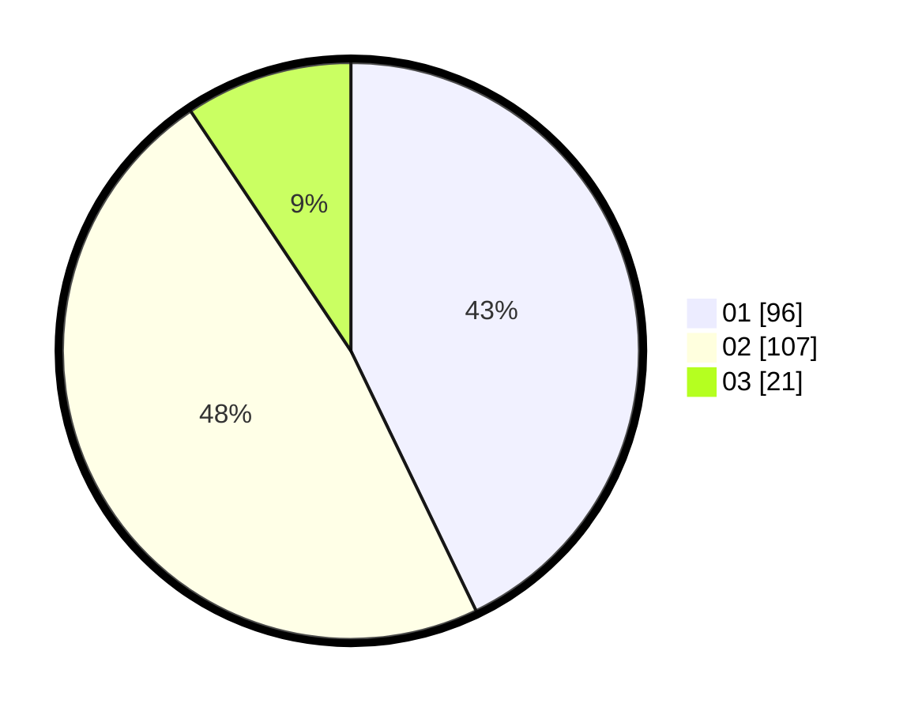

# Hasil

Hasil perolehan suara paslon dapat dilihat pada file paslon-01.txt, paslon-02.txt, dan paslon-03.txt.

Jika tidak ada, artinya data tersebut belum ada pada SIREKAP.

## Perolehan Suara

 * Paslon 01: **96**.
 * Paslon 02: **107**.
 * Paslon 03: **21**.

## Foto C Plano

https://sirekap-obj-formc.kpu.go.id/134f/pemilu/ppwp/31/72/04/10/06/3172041006144-20240214-204026--783b71e1-0123-4d29-842a-4cdaf16cd106.jpg

https://sirekap-obj-formc.kpu.go.id/134f/pemilu/ppwp/31/72/04/10/06/3172041006144-20240214-224429--2f780245-c4d7-41ee-83c2-833adbb8415a.jpg

https://sirekap-obj-formc.kpu.go.id/134f/pemilu/ppwp/31/72/04/10/06/3172041006144-20240214-204224--da18b81a-412f-4a14-995d-bf6a96770aef.jpg

## DATA PEMILIH TETAP

Jumlah pemilih dalam DPT: **235**.
 * L: **117**.
 * P: **118**.

## DATA PENGGUNA HAK PILIH

Jumlah pengguna hak pilih dalam DPT: **206**.
 * L: **101**.
 * P: **105**.

Jumlah pengguna hak pilih dalam DPTb: **1**.
 * L: **0**.
 * P: **1**.

Jumlah pengguna hak pilih dalam DPK: **16**.
 * L: **6**.
 * P: **10**.

Jumlah pengguna hak pilih: **223**.
 * L: **111**.
 * P: **112**.

## JUMLAH SUARA SAH DAN TIDAK SAH

JUMLAH SELURUH SUARA SAH: **220**.

JUMLAH SUARA TIDAK SAH: **3**.

JUMLAH SELURUH SUARA SAH DAN SUARA TIDAK SAH: **223**.
