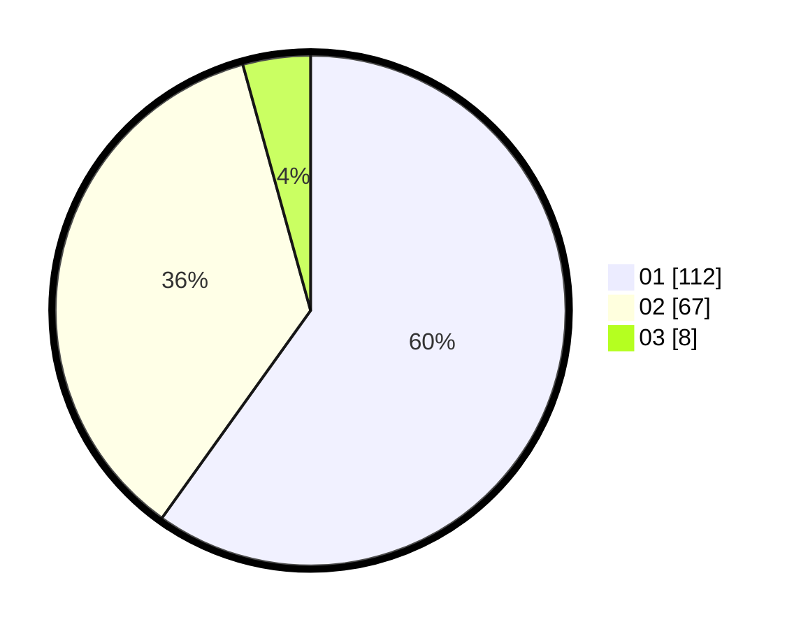

# Hasil

Hasil perolehan suara paslon dapat dilihat pada file paslon-01.txt, paslon-02.txt, dan paslon-03.txt.

Jika tidak ada, artinya data tersebut belum ada pada SIREKAP.

## Perolehan Suara

 * Paslon 01: **112**.
 * Paslon 02: **67**.
 * Paslon 03: **8**.

## Foto C Plano

https://sirekap-obj-formc.kpu.go.id/21e9/pemilu/ppwp/31/72/04/10/06/3172041006145-20240214-205400--ddba145f-0c0d-4dc8-8719-1ebb2e150049.jpg

https://sirekap-obj-formc.kpu.go.id/21e9/pemilu/ppwp/31/72/04/10/06/3172041006145-20240214-221430--51a71bc0-60e3-43a3-9694-b262313f8910.jpg

https://sirekap-obj-formc.kpu.go.id/21e9/pemilu/ppwp/31/72/04/10/06/3172041006145-20240214-205649--20aeb52c-efe6-4156-ae70-a58d38c69a52.jpg

## DATA PEMILIH TETAP

Jumlah pemilih dalam DPT: **246**.
 * L: **122**.
 * P: **124**.

## DATA PENGGUNA HAK PILIH

Jumlah pengguna hak pilih dalam DPT: **189**.
 * L: **91**.
 * P: **98**.

Jumlah pengguna hak pilih dalam DPTb: **0**.
 * L: **0**.
 * P: **0**.

Jumlah pengguna hak pilih dalam DPK: **0**.
 * L: **0**.
 * P: **0**.

Jumlah pengguna hak pilih: **189**.
 * L: **91**.
 * P: **98**.

## JUMLAH SUARA SAH DAN TIDAK SAH

JUMLAH SELURUH SUARA SAH: **187**.

JUMLAH SUARA TIDAK SAH: **2**.

JUMLAH SELURUH SUARA SAH DAN SUARA TIDAK SAH: **189**.
