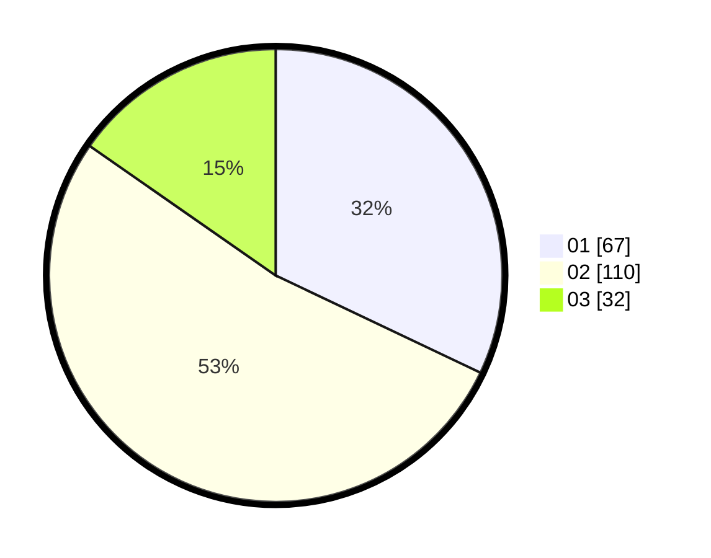

# Hasil

Hasil perolehan suara paslon dapat dilihat pada file paslon-01.txt, paslon-02.txt, dan paslon-03.txt.

Jika tidak ada, artinya data tersebut belum ada pada SIREKAP.

## Perolehan Suara

 * Paslon 01: **67**.
 * Paslon 02: **110**.
 * Paslon 03: **32**.

## Foto C Plano

https://sirekap-obj-formc.kpu.go.id/bfe5/pemilu/ppwp/31/72/04/10/07/3172041007004-20240215-005213--1730aef8-5290-4908-978f-46cd4c5642b1.jpg

https://sirekap-obj-formc.kpu.go.id/bfe5/pemilu/ppwp/31/72/04/10/07/3172041007004-20240214-204209--9f30a1c7-268b-4c6b-8f33-25ae8f5cab3d.jpg

https://sirekap-obj-formc.kpu.go.id/bfe5/pemilu/ppwp/31/72/04/10/07/3172041007004-20240214-192956--eb555861-5c59-4d84-8e47-57aa65edb1c0.jpg

## DATA PEMILIH TETAP

Jumlah pemilih dalam DPT: **287**.
 * L: **133**.
 * P: **154**.

## DATA PENGGUNA HAK PILIH

Jumlah pengguna hak pilih dalam DPT: **212**.
 * L: **98**.
 * P: **114**.

Jumlah pengguna hak pilih dalam DPTb: **2**.
 * L: **1**.
 * P: **1**.

Jumlah pengguna hak pilih dalam DPK: **2**.
 * L: **2**.
 * P: **0**.

Jumlah pengguna hak pilih: **216**.
 * L: **101**.
 * P: **115**.

## JUMLAH SUARA SAH DAN TIDAK SAH

JUMLAH SELURUH SUARA SAH: **209**.

JUMLAH SUARA TIDAK SAH: **7**.

JUMLAH SELURUH SUARA SAH DAN SUARA TIDAK SAH: **216**.
