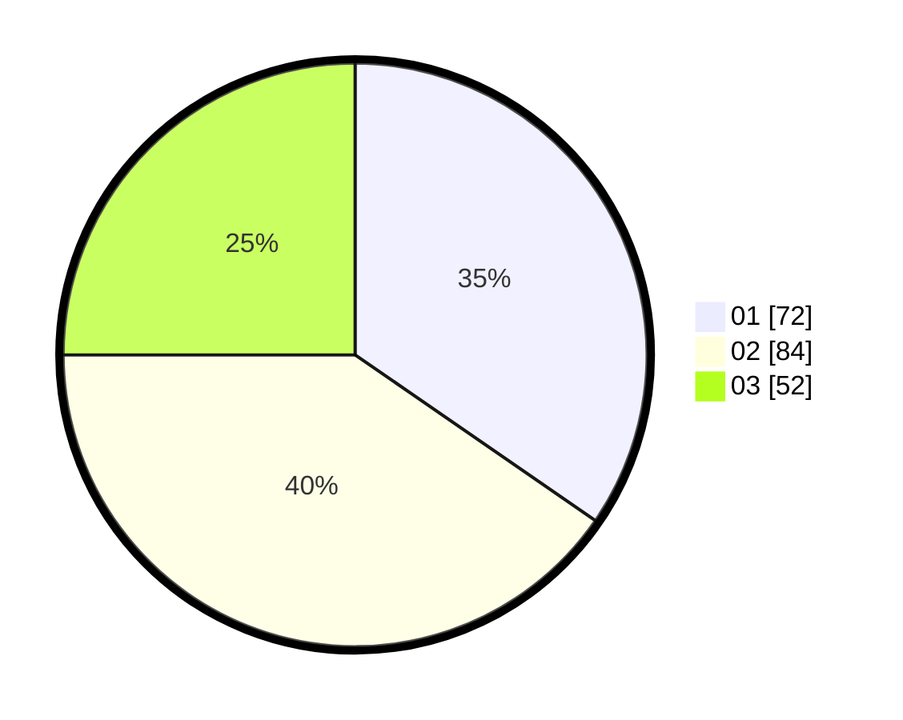

# Hasil

Hasil perolehan suara paslon dapat dilihat pada file paslon-01.txt, paslon-02.txt, dan paslon-03.txt.

Jika tidak ada, artinya data tersebut belum ada pada SIREKAP.

## Perolehan Suara

 * Paslon 01: **72**.
 * Paslon 02: **84**.
 * Paslon 03: **52**.

## Foto C Plano

https://sirekap-obj-formc.kpu.go.id/cbd6/pemilu/ppwp/31/72/04/10/07/3172041007005-20240215-214046--f8ce03e5-5683-4228-b9fd-f89a0d8aff54.jpg

https://sirekap-obj-formc.kpu.go.id/cbd6/pemilu/ppwp/31/72/04/10/07/3172041007005-20240215-214049--4f37bf4e-3e2a-443c-8850-ce4b278f6275.jpg

https://sirekap-obj-formc.kpu.go.id/cbd6/pemilu/ppwp/31/72/04/10/07/3172041007005-20240215-214048--7e226dad-c4c3-46d0-aea7-fac255ea5b48.jpg

## DATA PEMILIH TETAP

Jumlah pemilih dalam DPT: **263**.
 * L: **137**.
 * P: **126**.

## DATA PENGGUNA HAK PILIH

Jumlah pengguna hak pilih dalam DPT: **208**.
 * L: **109**.
 * P: **99**.

Jumlah pengguna hak pilih dalam DPTb: **0**.
 * L: **0**.
 * P: **0**.

Jumlah pengguna hak pilih dalam DPK: **3**.
 * L: **1**.
 * P: **2**.

Jumlah pengguna hak pilih: **211**.
 * L: **110**.
 * P: **101**.

## JUMLAH SUARA SAH DAN TIDAK SAH

JUMLAH SELURUH SUARA SAH: **208**.

JUMLAH SUARA TIDAK SAH: **3**.

JUMLAH SELURUH SUARA SAH DAN SUARA TIDAK SAH: **211**.
