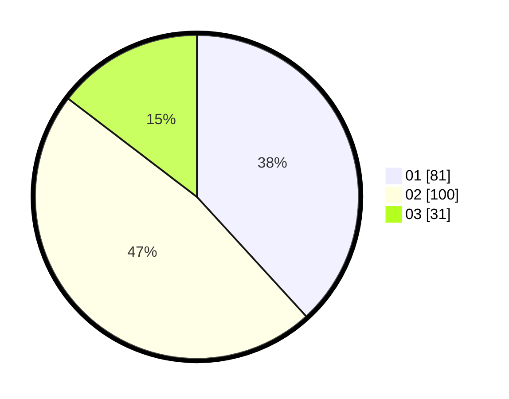

# Hasil

Hasil perolehan suara paslon dapat dilihat pada file paslon-01.txt, paslon-02.txt, dan paslon-03.txt.

Jika tidak ada, artinya data tersebut belum ada pada SIREKAP.

## Perolehan Suara

 * Paslon 01: **81**.
 * Paslon 02: **100**.
 * Paslon 03: **31**.

## Foto C Plano

https://sirekap-obj-formc.kpu.go.id/0f02/pemilu/ppwp/31/72/04/10/07/3172041007009-20240214-204441--d0656513-9d05-4359-bd82-2d706ced0c3d.jpg

https://sirekap-obj-formc.kpu.go.id/0f02/pemilu/ppwp/31/72/04/10/07/3172041007009-20240214-204526--b9fc86ed-43cc-422f-84ef-a425f6502374.jpg

https://sirekap-obj-formc.kpu.go.id/0f02/pemilu/ppwp/31/72/04/10/07/3172041007009-20240214-204601--bff0d552-44a7-44ac-9cbd-81033644aaae.jpg

## DATA PEMILIH TETAP

Jumlah pemilih dalam DPT: **245**.
 * L: **127**.
 * P: **150**.

## DATA PENGGUNA HAK PILIH

Jumlah pengguna hak pilih dalam DPT: **216**.
 * L: **95**.
 * P: **121**.

Jumlah pengguna hak pilih dalam DPTb: **0**.
 * L: **0**.
 * P: **0**.

Jumlah pengguna hak pilih dalam DPK: **0**.
 * L: **0**.
 * P: **2**.

Jumlah pengguna hak pilih: **218**.
 * L: **95**.
 * P: **123**.

## JUMLAH SUARA SAH DAN TIDAK SAH

JUMLAH SELURUH SUARA SAH: **212**.

JUMLAH SUARA TIDAK SAH: **6**.

JUMLAH SELURUH SUARA SAH DAN SUARA TIDAK SAH: **218**.
