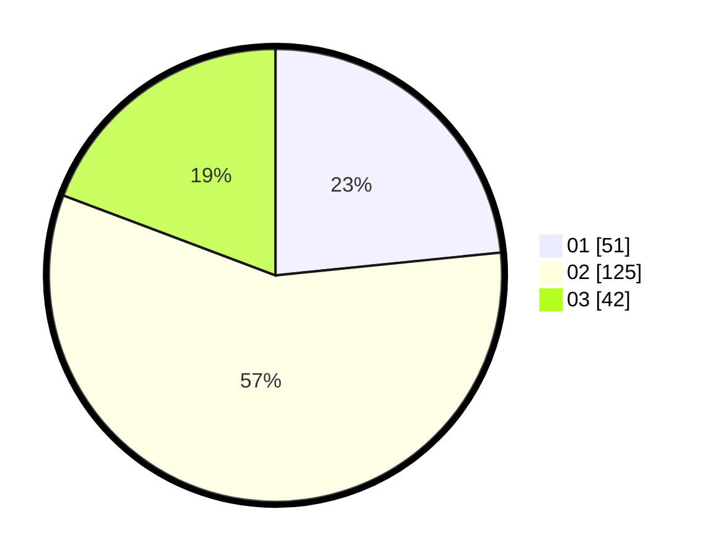

# Hasil

Hasil perolehan suara paslon dapat dilihat pada file paslon-01.txt, paslon-02.txt, dan paslon-03.txt.

Jika tidak ada, artinya data tersebut belum ada pada SIREKAP.

## Perolehan Suara

 * Paslon 01: **51**.
 * Paslon 02: **125**.
 * Paslon 03: **42**.

## Foto C Plano

https://sirekap-obj-formc.kpu.go.id/4741/pemilu/ppwp/31/72/04/10/07/3172041007020-20240214-200436--04e6ebf0-27fa-44d0-82d1-4b6a7f9f5a53.jpg

https://sirekap-obj-formc.kpu.go.id/4741/pemilu/ppwp/31/72/04/10/07/3172041007020-20240214-200604--a522b980-1377-44d5-858a-73b3cb8d7ddc.jpg

https://sirekap-obj-formc.kpu.go.id/4741/pemilu/ppwp/31/72/04/10/07/3172041007020-20240214-200707--4eaff0e8-6b1e-4df6-b7c8-ae993615bf8f.jpg

## DATA PEMILIH TETAP

Jumlah pemilih dalam DPT: **294**.
 * L: **145**.
 * P: **149**.

## DATA PENGGUNA HAK PILIH

Jumlah pengguna hak pilih dalam DPT: **224**.
 * L: **106**.
 * P: **118**.

Jumlah pengguna hak pilih dalam DPTb: **0**.
 * L: **0**.
 * P: **0**.

Jumlah pengguna hak pilih dalam DPK: **1**.
 * L: **0**.
 * P: **1**.

Jumlah pengguna hak pilih: **225**.
 * L: **106**.
 * P: **119**.

## JUMLAH SUARA SAH DAN TIDAK SAH

JUMLAH SELURUH SUARA SAH: **218**.

JUMLAH SUARA TIDAK SAH: **7**.

JUMLAH SELURUH SUARA SAH DAN SUARA TIDAK SAH: **225**.
