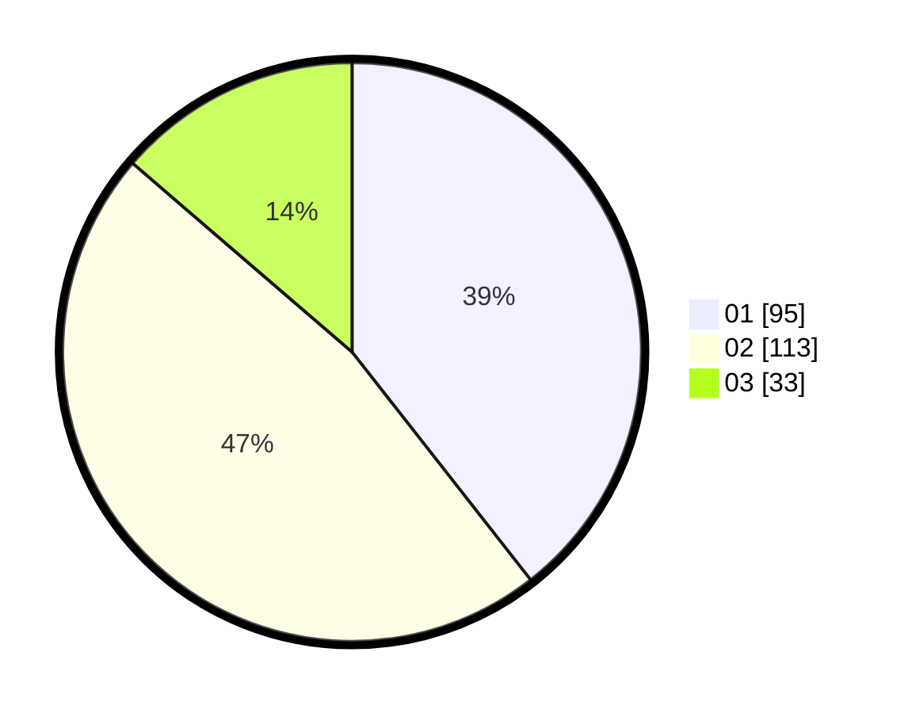

# Hasil

Hasil perolehan suara paslon dapat dilihat pada file paslon-01.txt, paslon-02.txt, dan paslon-03.txt.

Jika tidak ada, artinya data tersebut belum ada pada SIREKAP.

## Perolehan Suara

 * Paslon 01: **95**.
 * Paslon 02: **113**.
 * Paslon 03: **33**.

## Foto C Plano

https://sirekap-obj-formc.kpu.go.id/4ee4/pemilu/ppwp/31/72/04/10/07/3172041007023-20240214-155607--becbc567-8f1d-4754-826a-fcb83e2f7843.jpg

https://sirekap-obj-formc.kpu.go.id/4ee4/pemilu/ppwp/31/72/04/10/07/3172041007023-20240214-155632--9c396b73-9dc8-4ed9-b546-b37442a1aa3f.jpg

https://sirekap-obj-formc.kpu.go.id/4ee4/pemilu/ppwp/31/72/04/10/07/3172041007023-20240214-155647--f5886ce5-c2e5-44b8-903c-de3f786131fa.jpg

## DATA PEMILIH TETAP

Jumlah pemilih dalam DPT: **292**.
 * L: **148**.
 * P: **144**.

## DATA PENGGUNA HAK PILIH

Jumlah pengguna hak pilih dalam DPT: **245**.
 * L: **119**.
 * P: **126**.

Jumlah pengguna hak pilih dalam DPTb: **1**.
 * L: **0**.
 * P: **1**.

Jumlah pengguna hak pilih dalam DPK: **0**.
 * L: **0**.
 * P: **0**.

Jumlah pengguna hak pilih: **246**.
 * L: **119**.
 * P: **127**.

## JUMLAH SUARA SAH DAN TIDAK SAH

JUMLAH SELURUH SUARA SAH: **241**.

JUMLAH SUARA TIDAK SAH: **5**.

JUMLAH SELURUH SUARA SAH DAN SUARA TIDAK SAH: **246**.
