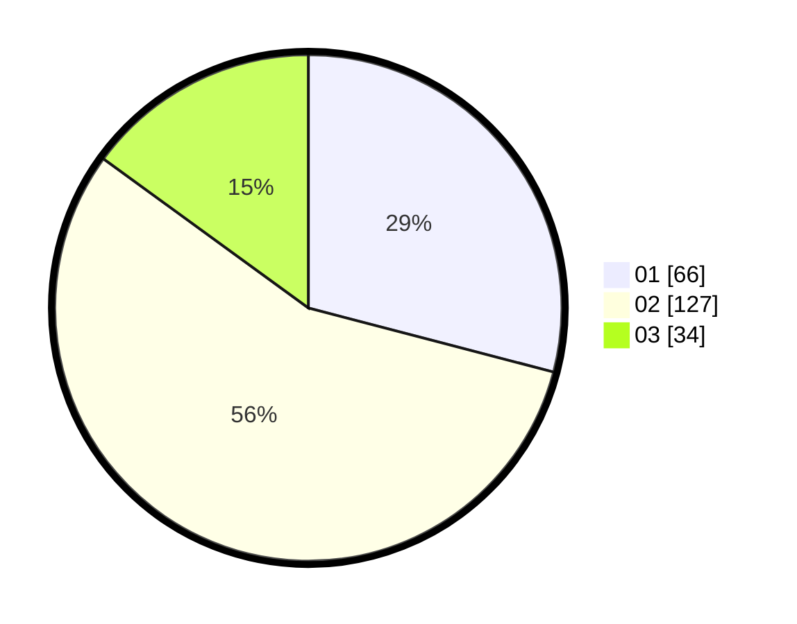

# Hasil

Hasil perolehan suara paslon dapat dilihat pada file paslon-01.txt, paslon-02.txt, dan paslon-03.txt.

Jika tidak ada, artinya data tersebut belum ada pada SIREKAP.

## Perolehan Suara

 * Paslon 01: **66**.
 * Paslon 02: **127**.
 * Paslon 03: **34**.

## Foto C Plano

https://sirekap-obj-formc.kpu.go.id/26d6/pemilu/ppwp/31/72/04/10/07/3172041007027-20240214-205903--912fe410-8a2b-493c-8cff-73adb5065cb7.jpg

https://sirekap-obj-formc.kpu.go.id/26d6/pemilu/ppwp/31/72/04/10/07/3172041007027-20240214-184539--9a2fcc29-96ce-4290-b1c9-6085294c194a.jpg

https://sirekap-obj-formc.kpu.go.id/26d6/pemilu/ppwp/31/72/04/10/07/3172041007027-20240214-184536--0a0d2450-6e9b-4ef6-9307-9357d4f667bd.jpg

## DATA PEMILIH TETAP

Jumlah pemilih dalam DPT: **285**.
 * L: **146**.
 * P: **139**.

## DATA PENGGUNA HAK PILIH

Jumlah pengguna hak pilih dalam DPT: **230**.
 * L: **111**.
 * P: **119**.

Jumlah pengguna hak pilih dalam DPTb: **0**.
 * L: **0**.
 * P: **0**.

Jumlah pengguna hak pilih dalam DPK: **3**.
 * L: **1**.
 * P: **2**.

Jumlah pengguna hak pilih: **233**.
 * L: **112**.
 * P: **121**.

## JUMLAH SUARA SAH DAN TIDAK SAH

JUMLAH SELURUH SUARA SAH: **227**.

JUMLAH SUARA TIDAK SAH: **6**.

JUMLAH SELURUH SUARA SAH DAN SUARA TIDAK SAH: **233**.
