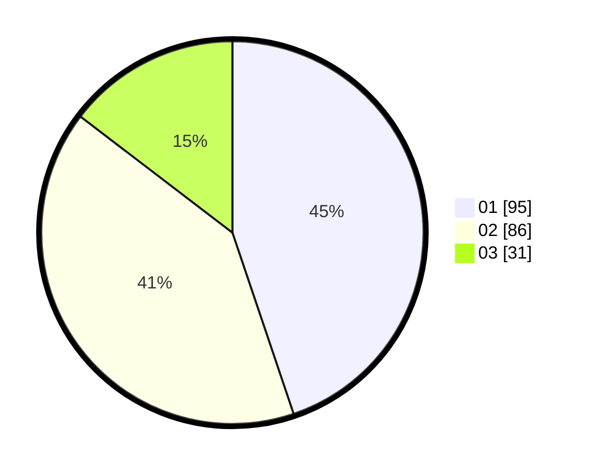

# Hasil

Hasil perolehan suara paslon dapat dilihat pada file paslon-01.txt, paslon-02.txt, dan paslon-03.txt.

Jika tidak ada, artinya data tersebut belum ada pada SIREKAP.

## Perolehan Suara

 * Paslon 01: **95**.
 * Paslon 02: **86**.
 * Paslon 03: **31**.

## Foto C Plano

https://sirekap-obj-formc.kpu.go.id/039f/pemilu/ppwp/31/72/04/10/07/3172041007029-20240214-155556--19596128-b56a-4190-a341-31a697b0580d.jpg

https://sirekap-obj-formc.kpu.go.id/039f/pemilu/ppwp/31/72/04/10/07/3172041007029-20240214-162225--ab502caa-8272-4c61-a057-fc5003102c06.jpg
