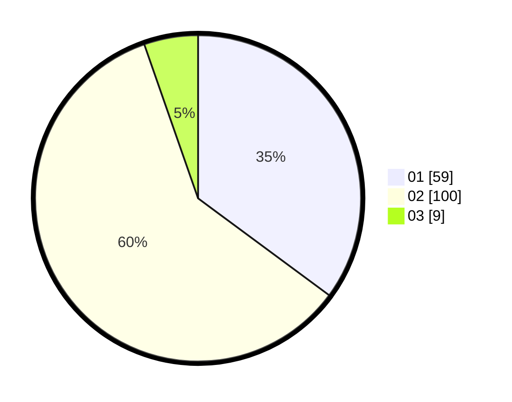

# Hasil

Hasil perolehan suara paslon dapat dilihat pada file paslon-01.txt, paslon-02.txt, dan paslon-03.txt.

Jika tidak ada, artinya data tersebut belum ada pada SIREKAP.

## Perolehan Suara

 * Paslon 01: **59**.
 * Paslon 02: **100**.
 * Paslon 03: **9**.

## Foto C Plano

https://sirekap-obj-formc.kpu.go.id/5d48/pemilu/ppwp/31/72/04/10/07/3172041007041-20240214-203730--cee1151a-bd85-4859-b8e9-295a7c46b7a1.jpg

https://sirekap-obj-formc.kpu.go.id/5d48/pemilu/ppwp/31/72/04/10/07/3172041007041-20240214-204013--54fa10b1-cab8-4f7c-82a4-c49a74edd0b7.jpg

https://sirekap-obj-formc.kpu.go.id/5d48/pemilu/ppwp/31/72/04/10/07/3172041007041-20240214-204235--ce267050-33fa-42d7-9c9f-58302861b1d6.jpg

## DATA PEMILIH TETAP

Jumlah pemilih dalam DPT: **237**.
 * L: **125**.
 * P: **112**.

## DATA PENGGUNA HAK PILIH

Jumlah pengguna hak pilih dalam DPT: **171**.
 * L: **90**.
 * P: **81**.

Jumlah pengguna hak pilih dalam DPTb: **0**.
 * L: **0**.
 * P: **0**.

Jumlah pengguna hak pilih dalam DPK: **0**.
 * L: **0**.
 * P: **0**.

Jumlah pengguna hak pilih: **171**.
 * L: **90**.
 * P: **81**.

## JUMLAH SUARA SAH DAN TIDAK SAH

JUMLAH SELURUH SUARA SAH: **168**.

JUMLAH SUARA TIDAK SAH: **3**.

JUMLAH SELURUH SUARA SAH DAN SUARA TIDAK SAH: **171**.
