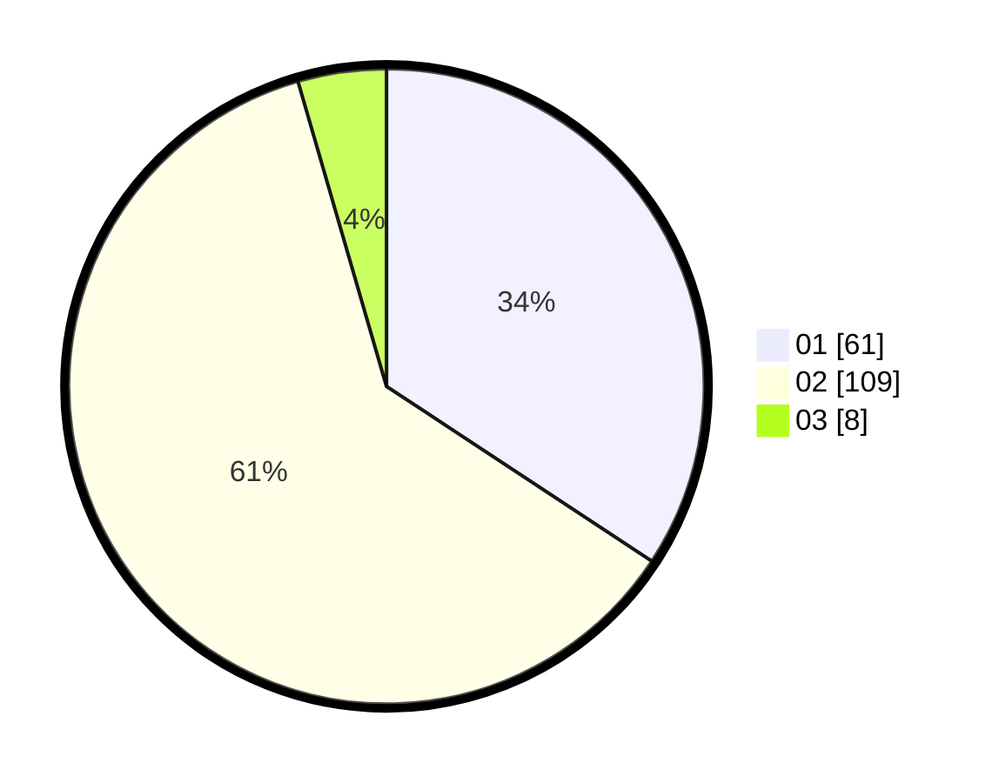

# Hasil

Hasil perolehan suara paslon dapat dilihat pada file paslon-01.txt, paslon-02.txt, dan paslon-03.txt.

Jika tidak ada, artinya data tersebut belum ada pada SIREKAP.

## Perolehan Suara

 * Paslon 01: **61**.
 * Paslon 02: **109**.
 * Paslon 03: **8**.

## Foto C Plano

https://sirekap-obj-formc.kpu.go.id/17f0/pemilu/ppwp/31/72/04/10/07/3172041007046-20240215-022836--15457b5d-aac8-4250-a868-3c8f5c11ff45.jpg

https://sirekap-obj-formc.kpu.go.id/17f0/pemilu/ppwp/31/72/04/10/07/3172041007046-20240215-023035--6a8ae6e1-8d27-48a6-829f-792000154c9c.jpg

https://sirekap-obj-formc.kpu.go.id/17f0/pemilu/ppwp/31/72/04/10/07/3172041007046-20240215-022932--c4200cf2-26ae-49fb-b070-ae5849ee89dc.jpg

## DATA PEMILIH TETAP

Jumlah pemilih dalam DPT: **179**.
 * L: **88**.
 * P: **91**.

## DATA PENGGUNA HAK PILIH

Jumlah pengguna hak pilih dalam DPT: **179**.
 * L: **88**.
 * P: **91**.

Jumlah pengguna hak pilih dalam DPTb: **0**.
 * L: **0**.
 * P: **0**.

Jumlah pengguna hak pilih dalam DPK: **1**.
 * L: **0**.
 * P: **1**.

Jumlah pengguna hak pilih: **180**.
 * L: **88**.
 * P: **92**.

## JUMLAH SUARA SAH DAN TIDAK SAH

JUMLAH SELURUH SUARA SAH: **178**.

JUMLAH SUARA TIDAK SAH: **2**.

JUMLAH SELURUH SUARA SAH DAN SUARA TIDAK SAH: **180**.
