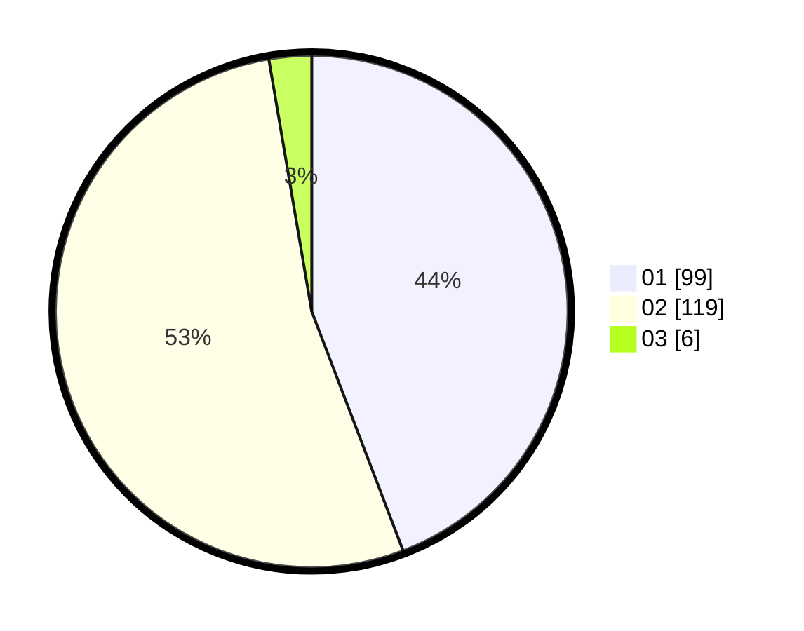

# Hasil

Hasil perolehan suara paslon dapat dilihat pada file paslon-01.txt, paslon-02.txt, dan paslon-03.txt.

Jika tidak ada, artinya data tersebut belum ada pada SIREKAP.

## Perolehan Suara

 * Paslon 01: **99**.
 * Paslon 02: **119**.
 * Paslon 03: **6**.

## Foto C Plano

https://sirekap-obj-formc.kpu.go.id/5c6a/pemilu/ppwp/31/72/04/10/07/3172041007051-20240214-200700--69914551-48cb-400d-8375-3be451aaeba4.jpg

https://sirekap-obj-formc.kpu.go.id/5c6a/pemilu/ppwp/31/72/04/10/07/3172041007051-20240214-201035--45d6768b-90ed-4451-bef4-4a46df377ff6.jpg

https://sirekap-obj-formc.kpu.go.id/5c6a/pemilu/ppwp/31/72/04/10/07/3172041007051-20240214-201130--228d6869-90c8-443b-836d-ade245b2f23e.jpg

## DATA PEMILIH TETAP

Jumlah pemilih dalam DPT: **283**.
 * L: **140**.
 * P: **143**.

## DATA PENGGUNA HAK PILIH

Jumlah pengguna hak pilih dalam DPT: **225**.
 * L: **114**.
 * P: **111**.

Jumlah pengguna hak pilih dalam DPTb: **0**.
 * L: **0**.
 * P: **0**.

Jumlah pengguna hak pilih dalam DPK: **2**.
 * L: **1**.
 * P: **1**.

Jumlah pengguna hak pilih: **227**.
 * L: **115**.
 * P: **112**.

## JUMLAH SUARA SAH DAN TIDAK SAH

JUMLAH SELURUH SUARA SAH: **224**.

JUMLAH SUARA TIDAK SAH: **3**.

JUMLAH SELURUH SUARA SAH DAN SUARA TIDAK SAH: **227**.
