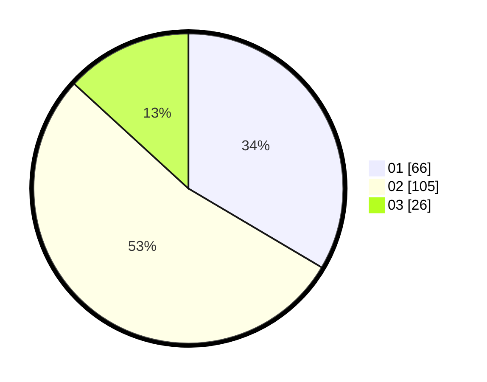

# Hasil

Hasil perolehan suara paslon dapat dilihat pada file paslon-01.txt, paslon-02.txt, dan paslon-03.txt.

Jika tidak ada, artinya data tersebut belum ada pada SIREKAP.

## Perolehan Suara

 * Paslon 01: **66**.
 * Paslon 02: **105**.
 * Paslon 03: **26**.

## Foto C Plano

https://sirekap-obj-formc.kpu.go.id/0677/pemilu/ppwp/31/72/04/10/07/3172041007053-20240214-185851--90689198-c5bf-4055-809d-c95865061c11.jpg

https://sirekap-obj-formc.kpu.go.id/0677/pemilu/ppwp/31/72/04/10/07/3172041007053-20240214-185914--3519dcfa-8c9a-43b9-9688-c7b8519fd6ca.jpg

https://sirekap-obj-formc.kpu.go.id/0677/pemilu/ppwp/31/72/04/10/07/3172041007053-20240214-185927--12c8b253-3cb5-4253-93a0-f7af9389ead8.jpg

## DATA PEMILIH TETAP

Jumlah pemilih dalam DPT: **289**.
 * L: **152**.
 * P: **137**.

## DATA PENGGUNA HAK PILIH

Jumlah pengguna hak pilih dalam DPT: **195**.
 * L: **96**.
 * P: **99**.

Jumlah pengguna hak pilih dalam DPTb: **1**.
 * L: **0**.
 * P: **1**.

Jumlah pengguna hak pilih dalam DPK: **2**.
 * L: **0**.
 * P: **2**.

Jumlah pengguna hak pilih: **198**.
 * L: **96**.
 * P: **102**.

## JUMLAH SUARA SAH DAN TIDAK SAH

JUMLAH SELURUH SUARA SAH: **197**.

JUMLAH SUARA TIDAK SAH: **1**.

JUMLAH SELURUH SUARA SAH DAN SUARA TIDAK SAH: **198**.
