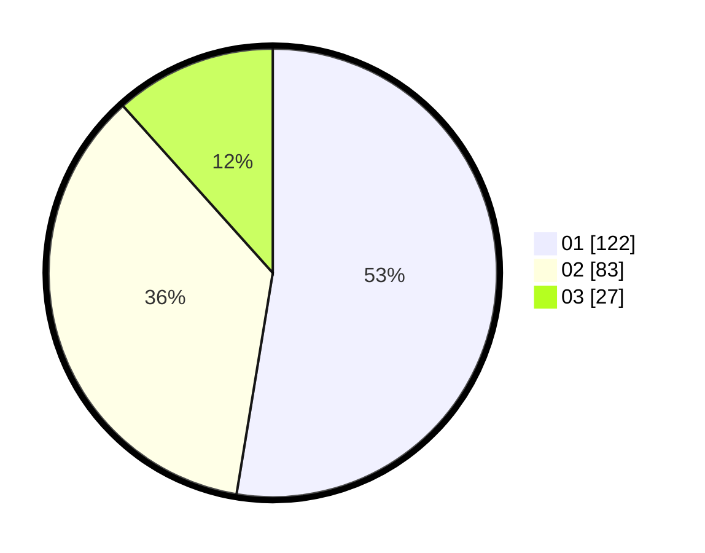

# Hasil

Hasil perolehan suara paslon dapat dilihat pada file paslon-01.txt, paslon-02.txt, dan paslon-03.txt.

Jika tidak ada, artinya data tersebut belum ada pada SIREKAP.

## Perolehan Suara

 * Paslon 01: **122**.
 * Paslon 02: **83**.
 * Paslon 03: **27**.

## Foto C Plano

https://sirekap-obj-formc.kpu.go.id/37fc/pemilu/ppwp/31/72/04/10/07/3172041007056-20240214-203624--ea604ca1-23dd-44bf-85f2-ab374f2dcd67.jpg

https://sirekap-obj-formc.kpu.go.id/37fc/pemilu/ppwp/31/72/04/10/07/3172041007056-20240214-203725--bee17c04-3ede-4e38-86ab-f58b3dfa2ff0.jpg
