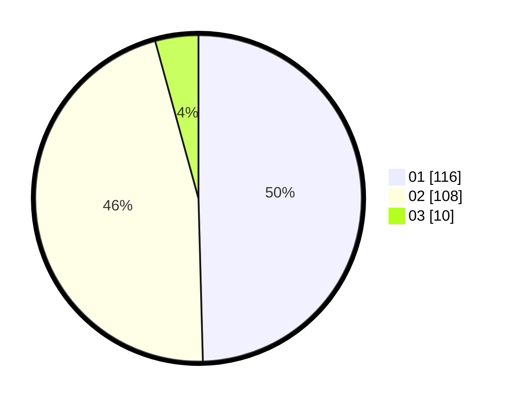

# Hasil

Hasil perolehan suara paslon dapat dilihat pada file paslon-01.txt, paslon-02.txt, dan paslon-03.txt.

Jika tidak ada, artinya data tersebut belum ada pada SIREKAP.

## Perolehan Suara

 * Paslon 01: **116**.
 * Paslon 02: **108**.
 * Paslon 03: **10**.

## Foto C Plano

https://sirekap-obj-formc.kpu.go.id/3287/pemilu/ppwp/31/72/04/10/07/3172041007059-20240214-203002--22dadb91-dcc3-420a-9d46-ca8bffee1005.jpg

https://sirekap-obj-formc.kpu.go.id/3287/pemilu/ppwp/31/72/04/10/07/3172041007059-20240216-141826--51a927c8-8bbe-4ef7-96fe-df7b772e3d60.jpg

https://sirekap-obj-formc.kpu.go.id/3287/pemilu/ppwp/31/72/04/10/07/3172041007059-20240216-141825--3cb93fb9-b71b-49da-ad22-5a3f77a3dacf.jpg

## DATA PEMILIH TETAP

Jumlah pemilih dalam DPT: **285**.
 * L: **132**.
 * P: **153**.

## DATA PENGGUNA HAK PILIH

Jumlah pengguna hak pilih dalam DPT: **234**.
 * L: **109**.
 * P: **125**.

Jumlah pengguna hak pilih dalam DPTb: **1**.
 * L: **0**.
 * P: **1**.

Jumlah pengguna hak pilih dalam DPK: **0**.
 * L: **0**.
 * P: **0**.

Jumlah pengguna hak pilih: **235**.
 * L: **109**.
 * P: **126**.

## JUMLAH SUARA SAH DAN TIDAK SAH

JUMLAH SELURUH SUARA SAH: **234**.

JUMLAH SUARA TIDAK SAH: **0**.

JUMLAH SELURUH SUARA SAH DAN SUARA TIDAK SAH: **234**.
