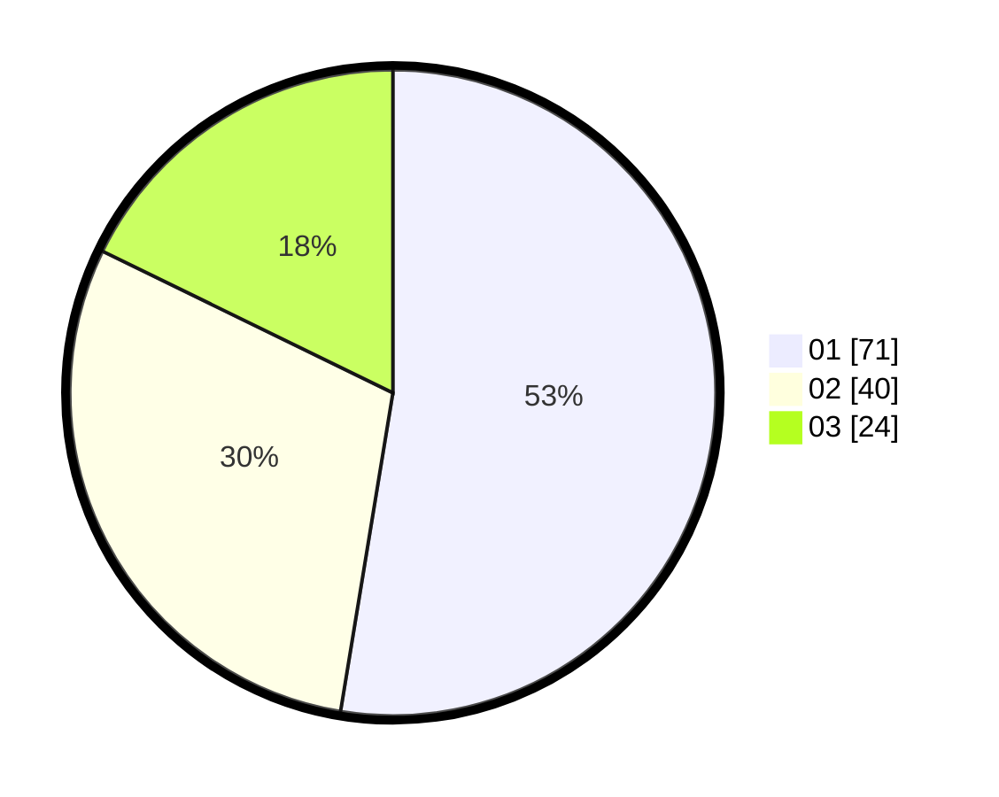

# Hasil

Hasil perolehan suara paslon dapat dilihat pada file paslon-01.txt, paslon-02.txt, dan paslon-03.txt.

Jika tidak ada, artinya data tersebut belum ada pada SIREKAP.

## Perolehan Suara

 * Paslon 01: **71**.
 * Paslon 02: **40**.
 * Paslon 03: **24**.

## Foto C Plano

https://sirekap-obj-formc.kpu.go.id/c87b/pemilu/ppwp/31/72/04/10/07/3172041007065-20240214-203318--77c139d6-dcff-425a-94b1-9e133429a84a.jpg

https://sirekap-obj-formc.kpu.go.id/c87b/pemilu/ppwp/31/72/04/10/07/3172041007065-20240214-203423--e43e4538-2430-471b-9ee7-71277d5aa8c6.jpg

https://sirekap-obj-formc.kpu.go.id/c87b/pemilu/ppwp/31/72/04/10/07/3172041007065-20240215-012732--06afecd9-426c-4f98-bd34-1277183f140c.jpg
