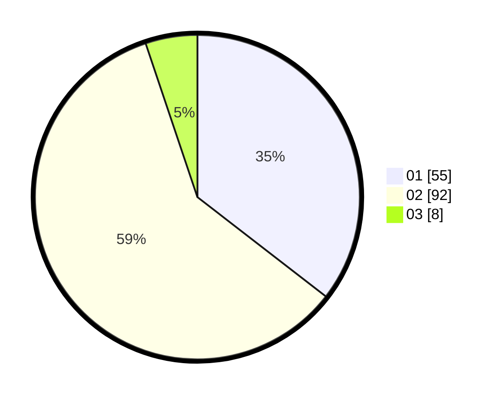

# Hasil

Hasil perolehan suara paslon dapat dilihat pada file paslon-01.txt, paslon-02.txt, dan paslon-03.txt.

Jika tidak ada, artinya data tersebut belum ada pada SIREKAP.

## Perolehan Suara

 * Paslon 01: **55**.
 * Paslon 02: **92**.
 * Paslon 03: **8**.

## Foto C Plano

https://sirekap-obj-formc.kpu.go.id/4fe8/pemilu/ppwp/31/72/04/10/07/3172041007072-20240214-220631--098109d6-de52-429a-b33a-e0539eb53af0.jpg

https://sirekap-obj-formc.kpu.go.id/4fe8/pemilu/ppwp/31/72/04/10/07/3172041007072-20240214-220734--2dc669bf-9b55-4a1d-a6b1-b2181f63e6fd.jpg

https://sirekap-obj-formc.kpu.go.id/4fe8/pemilu/ppwp/31/72/04/10/07/3172041007072-20240214-220807--a67f1998-c7d0-4587-bd0c-a954de0220f8.jpg

## DATA PEMILIH TETAP

Jumlah pemilih dalam DPT: **157**.
 * L: **72**.
 * P: **85**.

## DATA PENGGUNA HAK PILIH

Jumlah pengguna hak pilih dalam DPT: **157**.
 * L: **72**.
 * P: **85**.

Jumlah pengguna hak pilih dalam DPTb: **1**.
 * L: **0**.
 * P: **1**.

Jumlah pengguna hak pilih dalam DPK: **3**.
 * L: **1**.
 * P: **2**.

Jumlah pengguna hak pilih: **161**.
 * L: **73**.
 * P: **88**.

## JUMLAH SUARA SAH DAN TIDAK SAH

JUMLAH SELURUH SUARA SAH: **155**.

JUMLAH SUARA TIDAK SAH: **6**.

JUMLAH SELURUH SUARA SAH DAN SUARA TIDAK SAH: **161**.
