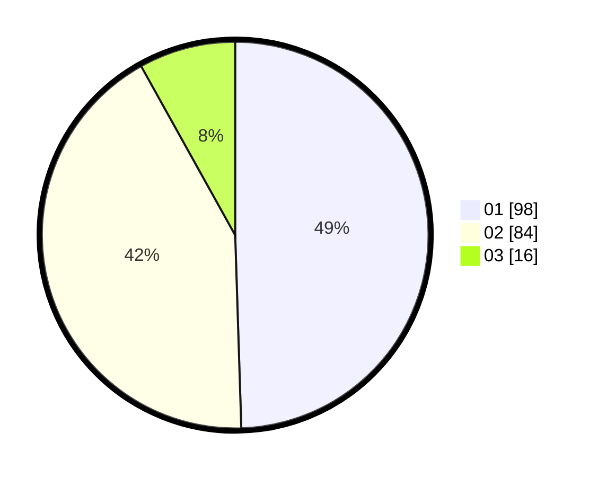

# Hasil

Hasil perolehan suara paslon dapat dilihat pada file paslon-01.txt, paslon-02.txt, dan paslon-03.txt.

Jika tidak ada, artinya data tersebut belum ada pada SIREKAP.

## Perolehan Suara

 * Paslon 01: **98**.
 * Paslon 02: **84**.
 * Paslon 03: **16**.

## Foto C Plano

https://sirekap-obj-formc.kpu.go.id/192e/pemilu/ppwp/31/72/04/10/07/3172041007079-20240214-221623--5d08bc39-3f72-4327-b45a-d29f6209374d.jpg

https://sirekap-obj-formc.kpu.go.id/192e/pemilu/ppwp/31/72/04/10/07/3172041007079-20240214-194909--eaca61f5-467e-4b57-a634-afda3e0006a7.jpg

https://sirekap-obj-formc.kpu.go.id/192e/pemilu/ppwp/31/72/04/10/07/3172041007079-20240214-194949--9e63842a-0e86-4d40-8b1f-f99fdadaeb3f.jpg

## DATA PEMILIH TETAP

Jumlah pemilih dalam DPT: **266**.
 * L: **136**.
 * P: **130**.

## DATA PENGGUNA HAK PILIH

Jumlah pengguna hak pilih dalam DPT: **201**.
 * L: **97**.
 * P: **104**.

Jumlah pengguna hak pilih dalam DPTb: **0**.
 * L: **0**.
 * P: **0**.

Jumlah pengguna hak pilih dalam DPK: **0**.
 * L: **0**.
 * P: **0**.

Jumlah pengguna hak pilih: **201**.
 * L: **97**.
 * P: **104**.

## JUMLAH SUARA SAH DAN TIDAK SAH

JUMLAH SELURUH SUARA SAH: **198**.

JUMLAH SUARA TIDAK SAH: **3**.

JUMLAH SELURUH SUARA SAH DAN SUARA TIDAK SAH: **201**.
